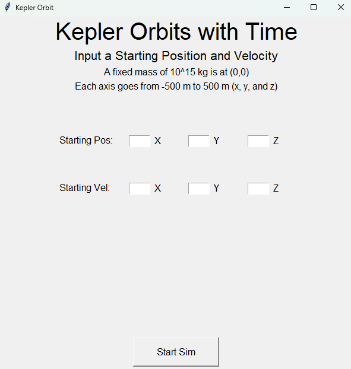
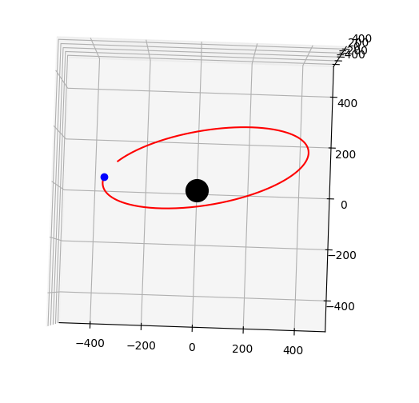
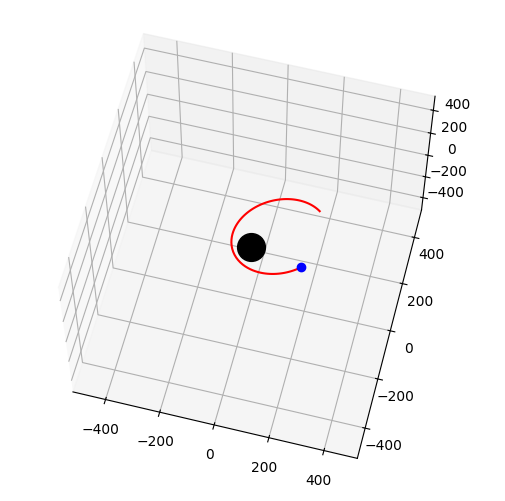
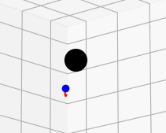

# Section 1.3 - Motion in the Kepler Orbit
This section compounds on the previous one by expanding on the ideas of Kepler orbit. The previous section talked about what the orbit looked like, but this section focused on how a particle actually moves inside this orbit. The section itself starts off with quickly mentioning Kepler's second and third law and using them to determine more properties about the orbit. We get a look into the period of an orbit, then get an earful of a lot of new definitions. We're introduced to the mean motion, mean anomaly, and eccentric anomaly. After this, the book does a lot of setting up equations and making relations for these new definitions (and introducing Kepler's equation) so that the fun part can happen. We take a brief aside to talk about the orbital averages and how to find them, and then transition into moving the equations of motion to a 2D plane and into a 3D coordinate system. A LOT of new terms are dropped here, but not used as the next section goes into solving equations for the position and velocity of a particle in orbit. The book mentions that you can do this the hard way with the 3D coordinate system, but the book uses Gauss's $f$ and $g$ functions to find these equations.

As per usual, I will first walk through any self imposed exercies I thought would be fun/benifical to me, talk about the coding project I made for this section, then end with my reflecting thoughts. More new to this section than the previous two is, I am going to add reflecting thoughts on the section itself as well as the project. My goal is to record my entire learning process thoughts and not just the coding part, as learning more astronomy is half of my goal for this. I will have to be careful, because there is a non-zero chance I'll just start complaining, but hey it's my project so my rules. That being said, I do want to try my best to keep this more centered around the learning part instead of the complaining part.

## Self Imposed Exercises
There is a lot this section leaves to the reader as an exercise, and because of this, it was hard to choose exactly I wanted to do for this section. I did end up trying a couple of different paths. The first part I tried doing was simplifying Gauss's $f$ and $g$ functions for hyperbolic orbits. I did end up re-writing them with these conditions in mind, but wasn't able to simplify them and it led to a gross mess of an equation. The next step was to mention the other route towards finding the equaiton of motion without using Gauss's functions and using the 3D equations for positioned outlined in 1.3.2. I worked on that for a bit, and realized that it was more of the same of the other exercise and was a lot of terms being thrown around and equation mangangement. I did kind of finish this one, but it's not the exercise I want to put here in this section. The one I want to spend my time on, is the orbital averages equation.

I know that this might seem silly, as the biggest reason I disliked the previous two exercises is that it was pretty much all trigonometry and hyperbolic trigonometry manipulation, and these equations are also a lot of that. However, these equations regard analytically solving integrals, which I found I am somewhat out of practice with. I figure, these exercises will give me a decent refresher on gross integrals, even if they're all more or less the same type of integral with some variation. Some of these integrals are more gross than others, but I figure this is good practice. After all, these self imposed exercises are more so for me to refresh on material rather than learn new material (that's what the project is for). Without further ado, let's get into it.

### Background Information
Before getting started with the actual derivations, I wanted to clarify some things. The first of which, is the definition for the orbital average. For a quantity $X(\mathbf{r}, \mathbf{v})$, the orbital average for an orbit with eccentricity $e$ and semi-major axis $s$ is as follows.

$$ \langle X \rangle = \frac{1}{2\pi} \int_{0}^{2\pi} X(1 - e\cos(u))du \quad = \frac{(1 - e^{2})^{1/2}}{2\pi} \int_{0}^{2\pi} \frac{X df}{(1 + e\cos(f))^{2}} $$

The book goes a little more into detail about how these came to be, but I mainly want them for reference for when we start finding the orbital averages. One of the forms will be more useful than others depending on the quantity $X$, so I would like to reference both.

The other equation I want to reference is the sine / cosine power reduction formulas. Going into this exercise, I forgot about these formulas and it made doing a couple integrals rather difficult. Somewhere along the way, I was reminded that they exist, and it makes dealing with all of the integrals I am about to do much easier. I wanted to state them so I can reference them later, but I will not be deriving them. This is because the steps are pretty simple and just require some use of integrating by parts. If you need a refresher on how these formulas are derived, I suggest looking it up elsewhere. However, here are the power reduction formulas.

$$ \int \cos^{n}(x) dx = \frac{1}{n}\cos^{n-1}(x)\sin(x) + \frac{n - 1}{n} \int \cos^{n-2}(x)dx $$
$$ \int \sin^{n}(x) dx = -\frac{1}{n}\sin^{n-1}(x)\cos(x) + \frac{n - 1}{n} \int \sin^{n-2}(x)dx $$

### Worked Out Orbital Averages
The book gives us 11 different orbital averages and the resulting values. For this section, I will first tell you what the final result is, and then proceed to evaluate the integral to obtain the result.

#### Equation 1.65a
$$ \langle a / r \rangle = 1 $$

For this one, the easier equation for the orbital average is the first one. Using the equation for $r$ in terms of the eccentric anomaly $u$, our starting integral looks like this.

$$ \frac{1}{2\pi} \int_{0}^{2\pi} \frac{a}{a(1 - e\cos(u))} \cdot (1 - e\cos(u)) du $$

Here the $a$'s and the $1 - e\cos(u)$ both cancel out, leading us to the following integral.

$$ \frac{1}{2\pi} \int_{0}^{2\pi} du  = u \bigg|_{0}^{2\pi} = \frac{1}{2\pi}[2\pi - 0] = \frac{1}{2\pi}\cdot 2\pi = 1$$

#### Equation 1.65b
$$ \langle r / a \rangle  = 1 + \frac{1}{2} e^{2}$$

For this one, the easier equation for the orbital average is the first one again. After this, I will start to skip the step of eliminating the $a$ term from the integral, as having either $r / a$ or $a / r$ is pretty much doing exactly that.

$$ \frac{1}{2\pi} \int_{0}^{2\pi} \frac{a(1 - e\cos(u))}{a}\cdot (1 - e\cos(u))du  = \frac{1}{2\pi} \int_{0}^{2\pi} (1 - e\cos(u))^{2} du$$

In order to evaluate this integral, we will need to first need to foil out the term inside the integral.

$$ \frac{1}{2\pi} \int_{0}^{2\pi} (1 - 2e\cos(u) + e^{2}\cos^{2}(u))du $$

We can break this up a little further, and seperate the various terms into their own integrals to make this problem a bit more digestable.

$$ \frac{1}{2\pi} \bigg[ \int_{0}^{2\pi} du - 2e \int_{0}^{2\pi} \cos(u) du + e^{2} \int_{0}^{2\pi} \cos^{2}(u) du \bigg]$$

Here, we can break down things easier. The first integral in this form is one we've already solved. Namely the solution to that one is just $2\pi$. Now we just need to solve the other two. Let's look at the second integral first.

$$ \int_{0}^{2\pi} \cos(u) du = \sin(u) \bigg|_{0}^{2\pi} = \sin(2\pi) - \sin(0) = 0 - 0 = 0 $$

Thus, showing that this is equal to zero. It is worth mentioning that if we had $ \int_{0}^{2\pi} \sin(u) du $ it would result in the same value. This is because the result of the integral would be $ -\cos(u) $ instead, and cosine is the same value at $0$ as it is at $2\pi. Now onto the next integral, which requires the use of our cosine power reduction formula mentioned earlier.

$$ \int_{0}^{2\pi} \cos^{2}(u) du = \frac{1}{2}\cos(u)\sin(u) + \frac{1}{2} \int_{0}^{2\pi} \cos^{0}(u) du = \frac{1}{2}\cos(u)\sin(u) + \frac{1}{2} u \bigg|_{0}^{2\pi} $$

This is fun, now we just need to plug everything in.

$$ = \frac{1}{2}\cos(2\pi)\sin(2\pi) + \frac{1}{2\pi} - \frac{1}{2}\cos(0)\sin(0) - \frac{1}{2} \cdot 0 = 0 + \pi - 0 - 0 = \pi $$

Which is a rather nice ending to this integral. Now we can substitute these values into the original integral we found before.

$$ \frac{1}{2\pi} \bigg[ \int_{0}^{2\pi} du - 2e \int_{0}^{2\pi} \cos(u) du + e^{2} \int_{0}^{2\pi} \cos^{2}(u) du \bigg] $$
$$ = \frac{1}{2\pi} \bigg[ 2\pi - 2e(0) + e^{2} (\pi) \bigg] $$
$$ = 1 + \frac{1}{2}e^{2} $$

#### Equation 1.65c
$$ \langle (r / a)^{2} \rangle  = 1 + \frac{3}{2}e^{2}$$

The integral for this orbital average is as follows.

$$ \frac{1}{2\pi} \int_{0}^{2\pi} (1 - e\cos(u))^{2}(1- e\cos(u)) du  = \frac{1}{2\pi} \int_{0}^{2\pi} (1 - e\cos(u))^{3} du$$

This ends up being a little gross but it all ends well I promise. Fortunately it's rather easy to foil this out.

$$ \frac{1}{2\pi} \int_{0}^{2\pi} (1 - 3e\cos(u) +3e^{2}\cos^{2}(u) - e^{3}\cos^{3}(u)) du $$

Seperating out for everything in terms of individual integrals yields the following.

$$ \frac{1}{2\pi} \bigg[ \int_{0}^{2\pi} du - 3e \int_{0}^{2\pi} \cos(u) du + 3e^{2} \int_{0}^{2\pi} \cos^{2}(u) du - e^{3} \int_{0}^{2\pi} \cos^{3}(u)du \bigg]$$

As before, we have already solved most of these integrals, with the exception of the last one. Before plugging everything into it, let's solve the last integral, which we can do using the power reduction formula.

$$ \int_{0}^{2\pi} \cos^{3}(u) du = \frac{1}{3}\cos^{2}(u)\sin(u) + \frac{2}{3} \int_{0}^{2\pi} \cos(u) du $$

We have also solved the last integral here, as it is just 0. Now we can forget this term and just focus on the trig terms.

$$ \frac{1}{3}\cos^{2}(u)\sin(u) \bigg|_{0}^{2\pi} = \frac{1}{3} (\cos^{2}(2\pi)\sin(2\pi) - \cos^{2}(0)\sin(0)) = \frac{1}{3} (0 - 0) = 0 $$

This is rather convenient, but the result makes sense given the properties of cosine. Now we use this result to determine the rest of the main integral.

$$ \frac{1}{2\pi} \bigg[ \int_{0}^{2\pi} du - 3e \int_{0}^{2\pi} \cos(u) du + 3e^{2} \int_{0}^{2\pi} \cos^{2}(u) du - e^{3} \int_{0}^{2\pi} \cos^{3}(u)du \bigg] $$
$$ = \frac{1}{2\pi} \bigg[ 2\pi -3e(0) + 3e^{2}(\pi) - e^{3}(0) \bigg] $$
$$ = 1 + \frac{3}{2}e^{2} $$

#### Equation 1.65d
$$ \langle (r/a)^{2}\cos^{2}(f) \rangle = \frac{1}{2} + 2e^{2} $$

This one, and the next few orbital averages, contain a $\cos(f)$ or $\sin(f)$, which need to be translated into terms of $u$. The book provides these relations, but when setting up the integral I am going to skip over this step to save time / space. Here is the integral for this average.

$$ \frac{1}{2\pi} \int_{0}^{2\pi} (1 -e\cos(u))^{2} \cdot \bigg( \frac{\cos(u) - e}{1 - e\cos(u)} \bigg)^{2} \cdot (1 - e\cos(u))du $$

While this looks a big gross, the denominator for the fraction ends up canceling out, which in turn, also elimintes some on the top (since that's how elimination works). This leaves us left with the following.

$$ \frac{1}{2\pi} \int_{0}^{2\pi} (1 - e\cos(u))(cos(u) - e)^{2}du $$

This is marginally better, but this is going to require some distributing to get to a nice form.

$$ \frac{1}{2\pi} \int_{0}^{2\pi} (1 - e\cos(u)) (\cos^{2}(u) - 2e\cos(u) + e^{2})du $$
$$ = \frac{1}{2\pi} \int_{0}^{2\pi} \bigg( \cos^{2}(u) -2e\cos(u) + e^{2} -e\cos^{3}(u) + 2e^{2}\cos^{2}(u) - e^{3}\cos(u) \bigg) du$$

I'm going to skip some steps here. Basically, we know that the $\cos(u)$ and $\cos^{3}(u)$ will end up being 0, so I am going to drop these terms. I am also going to combine like terms, which simplifies the integral nicely.

$$ \frac{1}{2\pi} \int_{0}^{2\pi} \bigg( e^{2} + (1 + 2e^{2})\cos^{2}(u) \bigg) du $$
$$ \frac{1}{2\pi} \bigg( e^{2} (2\pi) + (1 + 2e^{2})(\pi) \bigg) $$
$$ e^{2} + \frac{1}{2} + e^{2} $$
$$ \frac{1}{2} + 2e^{2} $$

#### Equation 1.65e
$$ \langle (r / a)^{2}\sin^{2}(f) \rangle = \frac{1}{2} - \frac{1}{2}e^{2} $$

Like last time, I am going to plug in the relation for $\sin(f)$ in terms of $u$. Doing so gives us the following integral.

$$ \frac{1}{2\pi} \int_{0}^{2\pi} (1 - e\cos(u))^{2} \cdot \bigg( \frac{(1 - e^{2})^{1/2} \sin(u)}{1 - e\cos(u)} \bigg)^{2} \cdot (1 - e\cos(u)) du $$

This integral is a bit much, but some things end up canceling out, such as the denominator. Similarly, the square removes the square root on the $1 - e^{2}$ term, and because this is a constant, we can move this to the outside. THis yields the following integral.

$$ \frac{1 - e^{2}}{2\pi} \int_{0}^{2\pi} (1 - e\cos(u))\sin^{2}(u) du $$
$$ \frac{1 - e^{2}}{2\pi} \bigg[ \int_{0}^{2\pi} \sin^{2}(u) du - e \int_{0}^{2\pi} \cos(u)\sin^{2}(u) du \bigg] $$

Not so bad. Now we have two integrals we have yet to solve, but fortunatelly they won't be so bad either. The first integral requires us to use the power reduction formula for sine instead of cosine.

$$ \int_{0}^{2\pi} \sin^{2}(u) du = -\frac{1}{2}\sin(u)\cos(u) + \frac{1}{2} \int_{0}^{2\pi} du $$

We have seen these values before. The first term ends up evaluating to 0 and the second term will evaluate to $\frac{1}{2} (2\pi)$ otherwise known as $\pi$. The other integal is rather easy to evaluate as it just requires a simple $v$-substitution.

$$ \int_{0}^{2\pi} \sin^{2}(u) \cos(u) du $$
$$ v = \sin(u), \quad dv = \cos(u)du $$
$$ \int v^{2}dv  = \frac{1}{3}v^{3} = \frac{1}{3}\sin^{3}(u) \bigg|_{0}^{2\pi}$$
$$ = \frac{1}{3} (\sin^{3}(2\pi) - \sin^{3}(0)) = \frac{1}{3} (0 - 0) = 0 $$

Thus, another integral that evaluates to zero. Plugging these values back into the original integral yields the following.

$$ \frac{1 - e^{2}}{2\pi} \bigg[ \int_{0}^{2\pi} \sin^{2}(u) du - e \int_{0}^{2\pi} \cos(u)\sin^{2}(u) du \bigg] $$
$$ = \frac{1 - e^{2}}{2\pi} (\pi - e(0)) $$
$$ = \frac{1 - e^{2}}{2} $$
$$ = \frac{1}{2} - \frac{1}{2}e^{2} $$

#### Equation 1.65f
$$ \langle (r / a)^{2}\cos(f)\sin(f) \rangle = 0 $$

Same as last time, I will skip the step where I substitute in the trig terms for $f$ in terms of $u$. I am also going to merge the starting term with the $r / a$ term, to save some time/space. The resulting integral looks like the following.

$$ \frac{1}{2\pi} \int_{0}^{2\pi} (1 - e\cos(u))^{3} \cdot \frac{\cos(u) - e}{1 - e\cos(u)} \cdot \frac{(1 - e^{2})^{1/2} \sin(u)}{1 - e\cos(u)}$$

Fortunately some stuff cancels so we don't have to worry about nasty fractions. Similarly, the $(1 - e^{2})^{1/2}$ term can be carried out as a constant. Dsitributing and rearanging this integral yields the following.

$$ \frac{(1 - e^{2})^{1/2}}{2\pi} \int_{0}^{2\pi} \bigg( (1 + e^{2})\cos(u) - e \cos^{2}(u) - e \bigg) \sin(u) du $$

Breaking this down into individual integrals gives us the following.

$$ \frac{(1 - e^{2})^{1/2}}{2\pi} \bigg[ (1 + e^{2}) \int_{0}^{2\pi} \cos(u)\sin(u)du - e \int_{0}^{2\pi} \cos^{2}(u)\sin(u)du - e \int_{0}^{2\pi} \sin(u)du \bigg] $$

This form is rather nice, as we have already evaluated the first and third integral, both of which ended up being 0. This means we only need to concern ourself with the second integral, which is easily done with a substitution.

$$ \int_{0}^{2\pi} \cos^{2}(u)\sin(u)du $$
$$ v = \cos(u), \quad dv = -\sin(u)du $$
$$ - \int v^{2}dv = -\frac{1}{3} v^{3} = -\frac{1}{3}\cos^{3}(u) \bigg|_{0}^{2\pi} $$
$$ = -\frac{1}{3} (\cos^{3}(2\pi) - \cos^{3}(0)) = -\frac{1}{3}(1 - 1) = 0 $$

Which is also rather nice. Now that all of the integrals are equal to zero, here is all we are left with.

$$ \frac{1 - e^{2}}{2\pi} \cdot (0) $$
$$ = 0 $$

#### Equation 1.66a
$$ \langle (a / r)^{2} \rangle = (1 - e^{2})^{-1/2} $$

Unlike the previous six integrals, this one and the four after will make use of the other definition of orbital averages. I bet you could solve it using the definition we've been using, but this ends up being a lot easier. The starting integral looks like the following.

$$ \frac{(1 - e^{2})^{3/2}}{2\pi} \int_{0}^{2\pi} \bigg( \frac{1 + e\cos(f)}{(1 - e^{2})} \bigg) ^{2} \cdot \frac{df}{(1 - e\cos(f))^{2}}$$

This ends up canceling out really nicely.

$$ \frac{(1 - e^{2})^{3/2}}{2\pi (1 - e^{2} )^{2}} \int_{0}^{2\pi} df $$

We know this integral's value and we can simplify the constant outside the integral as well.

$$ \frac{(1 - e^{2})^{-1/2}}{2\pi} \cdot (2\pi) $$
$$ = (1 - e^{2})^{-1/2} $$

#### Equation 1.66b
$$ \langle (a / r)^{3} \rangle = (1 - e^{2})^{-3/2} $$

The starting integral looks like the following.

$$ \frac{(1 - e^{2})^{3/2}}{2\pi} \int_{0}^{2\pi} \bigg( \frac{1 + e\cos(f)}{(1 - e^{2})} \bigg) ^{3} \cdot \frac{df}{(1 + e\cos(f))^{2}}$$

We can factor out the term in the denominator very easily like last time, and cancel some terms out. This yields the following.

$$ \frac{(1 - e^{2})^{3/2}}{2\pi (1 - e^{2})^{3}} \int_{0}^{2\pi} (1 + e\cos(f))df$$
$$ = \frac{1}{2\pi (1 - e^{2})^{3/2}} \bigg[ \int_{0}^{2\pi} df + e \int_{0}^{2\pi}\cos(f)df \bigg]$$

Now, these are integrals we've already solved before. The one on the left is simply $2\pi$ and the integral on the right is simply $0$. Plugging these values in, gives us the following.

$$ = \frac{1}{2\pi (1 - e^{2}) ^{3/2}} (2\pi)$$
$$ = (1 - e^{2})^{-3/2} $$

#### Equation 1.66c
$$ \langle (a / r)^{3} \cos^{2}(f) \rangle = \frac{1}{2} (1 - e^{2})^{-3/2} $$

Unlike the previous times we had a $\cos(f)$ or $\sin(f)$ term, we do not need to put it in terms of $u$ as we are already working with $f$. The starting integral looks like the following.

$$ \frac{(1 - e^{2})^{3/2}}{2\pi} \int_{0}^{2\pi} \bigg( \frac{1 + e\cos(f)}{(1 - e^{2})} \bigg) ^{3} \cdot \frac{\cos^{2}(f)df}{(1 + e\cos(f))^{2}} $$
$$ = \frac{(1 - e^{2})^{-3/2}}{2\pi} \int_{0}^{2\pi} (1 + e\cos(f)) \cos^{2}(f) df $$
$$ = \frac{(1 - e^{2})^{-3/2}}{2\pi} \int_{0}^{2\pi} (\cos^{2}(f) + e\cos^{3}(f)) df $$

Here we can use the values of integrals we already know to solve it. The first integral yields $\pi$, and the second integral yields $0$, as we have seen before. Plugging these values into the expression gives us the following.

$$ \frac{(1 - e^{2})^{-3/2}}{2\pi} (\pi + e\cdot 0) $$
$$ = \frac{1}{2} (1 - e^{2})^{-3/2} $$

## Description of Project
Since this section was about the motion in a Kepler orbit, I wanted to make an animation that showed the actual motion of a particle in an orbit given certain initial conditions, in this case, starting position and starting velocity. I wanted to make sure this program also showcased elliptical orbits as well as hyberolic orbits as well. This project is very similar to the project from Section 1.2, but slightly different. The project from the previous section showed an animation of a Kepler orbit using the true anomaly as the input variable, while this one would focus more on the input variable being time instead. Another addition I wanted to add was changing the representation from 2D to 3d. This section of the book had a subsection that talked about the representation of an orbit in 3D and I wanted to capture that in my project as well. It was also rather convenient that the final subsection generalized it so that the dimentions (or reference frame) didn't matter too much.

### Creating the GUI
I wanted to talk about this first, as it is the least interesting of the comments I have about the project. The GUI itself is modeled after the GUI from the project in Section 1.2. I used the Tkinter library to create it, and even kept most of the formating the same. There is a brief instruction set as well as text boxes to input the starting values for both position and velocity. I even kept the error handling the same just in case the user tries to give invalid inputs.

<p align="center">

</p>

### Vector3D
Since I wanted to make this project in a 3D coorindate system, I needed to update my vector class to the new dimention. Most of this method is exactly what you would expect, just adjusting for the $z$ term for 3D. However, there are a few interesting parts I wanted to discuss.

Later on I needed the magnitude of the cross product of two vectors, so I added a method to this class to do exactly that. However, this also required a method to determine the angle between two vectors as well. The method that calculates the magnitude of the cross product is done using the equation for the magnitude of the cross product, instead of calculating the cross product and taking the magnitude then.

The other method I added was the copy method. As someone who teaches a computer science class, I should have been able to determine this was needed much earlier. Many times in my code, I was accidently creating variables to were all assigned to the same object. When I changed what I thought was a temporary variable was actually the original vector I was using. The copy method just creates a new vector with the same coordinates as the parent, but allows me to modify it without changing the original.

### Plotting Elliptical Orbits
I started by first making sure that I was able to plot elliptical orbits before getting too deep into the project. I did this by using Gauss's $f$ and $g$ functions, which are defined using the following equation.

$$ \mathbf{r} (t) = f(t,t_{0})\mathbf{r_{0}} + g(t,t_{0})\mathbf{v_{0}} $$

Where $\mathbf{r_{0}}$ is the initial position of the partical and $\mathbf{v_{0}}$ is the initial velocity of the particle. Using this definition, many other relations found earlier in the book, and a lot of algebraic manipulation, one can find Gauss's functions in terms of the true anomaly and eccentric anomaly. Since the eccentric anomaly (designated using the letter $u$) is the easiest one that directly corrilates to time, this is the variation I used. The book gives us this equation, but just to be certain I understood what was happening, I made sure to do it myself as well (for my worked out solution to this, see Problem 12 in the Chapter Problems file). These equations ended up being the following.

$$ f(t, t_{0}) = \frac{\cos(u - u_{0}) - e\cos(u_{0})}{1 - e\cos(u_{0})} $$
$$ g(t, t_{0}) = \frac{1}{n} [\sin(u - u_{0}) - e\sin(u) + e\sin(u - u_{0})] $$

Now that we have this, we can find the motion of a particle around a mass, as the variable $u$ relates to the mean anomaly, which relates to time. Before actually getting into things, we need one more relation, which relates the semi-major axis ($a$) with the magnitudes of the starting positions. This relation is seen below.

$$ \frac{1}{a} = \frac{2}{r} - \frac{v^{2}}{GM} $$

Now we have everything we need to actually plot the equation of motion. It just needs to be broken down into a couple of steps.

1. First, compute $r_{0} = |\mathbf{r_{0}}|$ and $v_{0} = |\mathbf{v_{0}}|$
2. Use the relation mentioned above the find the semi-major axis $a$
3. Use the semi-major axis to find the mean motion using Kepler's Law
4. Use the initial conditions to determine the magnitude of the angular momentum $L = |\mathbf{r_{0}} \times \mathbf{v_{0}}|$
5. Use the magnitude of the angular momentum and the semi-major axis to find the eccentricity $e$
6. Use the semi-major axis, eccentricity, and $r_{0}$ to determine $\cos(u_{0})$ then take the inverse cosine function to determine $u_{0}$
7. Use Kepler's Equaiton to determine the initial mean anomaly $l_{0}$
8. Use the equation with respect to time to determine $l$ at a given time $t$
9. Use Kepler's equation to determine $u$ for a time $t$
10. Use $u$ to find the values for Gauss's functions $f$ and $g$
11. Use Gauss's functions to find the position of the particle for the given time.

Simple stuff. With all of these steps, I was able to plot an elliptical orbit for a particle mass. However, before jumping into the final result, there are a couple of points I want to talk about first.

#### Solution to Kepler's Equation
The book mentioned that Kepler's equation cannot be solved analytically, and needs to be done numerically. The solution I ended up using was fixed-point iteration. I saw that technically Newton's method converged faster, but wikipedia said that fixed-point interation was identical to Kepler's solution, so I stuck with that. Here is the code for it.

```python
def calc_u(l, ecc, accuracy):
  E = l
  err = E
  while (err > accuracy):
    temp = l + ecc * np.sin(E)
    err = np.abs(E - temp)
    E = temp
  return E
```
It is a little robust, and the accuracy term isn't entirely reliable due to floating point error, but this is what I used to find $u$ from the mean anomaly.

#### Temporary Confusion
So, I used all of these steps, and set up the program so that it could take in a starting position and velocity and then plot the resulting elliptical orbit. I chose some random numbers for these values that kept the eccentricity below 1, and I obtained the following result.

<p align="center">

</p>

This... wasn't correct. And for a long time, I was confused on what was happening. Eventually, the error I made was in step 6 when taking the inverse cosine to determine $u_{0}$. The inverse cosine function is only defined for angles between $0$ and $\pi$, so when we reach a point where $u_{0}$ is greater than $\pi$, the program freaks out and plots a very incorrect graph.

Fortunately, this is an easy fix, as we just need to know the sign of the radial velocity $\dot{r}$. When $\dot{r}$ is positive, $0 < u_{0} < \pi$, and when $\dot{r}$ is negative, $\pi < u_{0} < 2\pi$. Honestly, I wasn't able to figure this out analytically that didn't involve a bunch of extra math that I didn't really want to do. The book only has a couple relations that involve the radial velocity that depends on other variables. The first one involves $\dot{r}$ being squared, which doesn't tell us the sign, and the other depends on $u$, which is what we're trying to solve for. 

I solved this problem numerically. Since we start with a starting position AND velocity, what I did was add the starting velocity to the starting position, then checked to see if the magnitude was greater or smaller than the starting position. If it was greater, than the radial velocity was increasing, if it was lesser, then the radial velocity was decreasing. Adding in this fix was able to make sure all orbits were plotted correctly.

<p align="center">

</p>

### Plotting Hyperbolic Orbits
The biggest reason I wanted to implement this orbit was because it's rather difficult to tell whether a certain orbit will be an ellipse or hyperbola when supplying the starting position and velocity. On top of this, I think a pass-by hyperbolic orbit would be fun to witness. However, we need to know how to code this, which theoretically, shouldn't be that bad. We just need to determine the equations for Gauss's $f$ and $g$ functions when eccentricity is greater than 1.

Fortunately, the book gives relations for the true anomaly to the hyperbolic eccentric anomaly. These relations are shown below.

$$ \cos(f) = \frac{e - \cosh(u)}{e\cosh(u) - 1}, \quad \sin(f) = \frac{(e^{2}-1)^{\frac{1}{2}}\sinh{u}}{e\cosh{u} - 1} $$

The book also provides equations for Gauss's functions in terms of the true anomaly, also given below. So it should be a matter of using the relations mentioned earlier to find Gauss's functions in terms of the hyperbolic eccentric anomaly.

$$ f(t, t_{0}) = \frac{\cos(f - f_{0}) + e\cos(f)}{1 + e\cos(f)} $$
$$ g(t, t_{0}) = \frac{(e^{2} - 1)^{\frac{3}{2}} \sin(f - f_{0})}{n(1 + e\cos(f))(1 + e\cos(f_{0}))} $$

Now, I wasn't able to simplify this analytically. Creating the functions is easy enough as it is just a matter of substitution, but it looks gross and I feel like it could be simplified. I tried for a while, but I wasn't able to figure that part out, so I stuck with the gross looking. However, the general process for solving these orbits is the same steps used for elliptical orbits.

I used this method to calculate the hyperbolic orbit for a particle when the eccentricity was greater than 1. However, whenever I used starting conditions for the program, I saw an orbital path that, seemingly, just traced a straight line. This remained true even for eccentricities really close to 1 (such as 1.0003). To verify that anything was happening, I then oriented the graph so that I was witnessing a head-on path of the particle. And what I saw was the particle genuinely curving.

<p align="center">

</p>

As seen from the picture, there is *some* deviaiton that at least seems to resemble a hyperbolic motion, although I did not verify this outside of an eye test. I am not entirely sure why this particular method does not work. Just to be certain I was doing the process correctly, I kept the same gross unsimplified Gauss's function and plugged in the relations for elliptical orbits instead. Upon doing so, nothing changed between this and what I was doing before. I am sure I missed something, but I am unsure what it is. Because it is so similar to a hyperbolic orbit, just really stretched, I am fine leaving it as it is.

## Reflecting Thoughts
Alright, so this first paragraph will center around my thoughts about reading through/learning the chapter and the next few will be about my project and other general ideas. Because of this, I am writing this as soon as I am done reading the section (and understanding it) so there will be a large break between this one and the next one. I am not entirely sure how this will work, but if I don't like it, I'll change it for next time.

### Section 1.3 Thoughts
I found this section to be significally more digestable than the previous section. In the previous section, I really felt like the jumps in the steps were a lot harder to grasp. However, this section connceted a lot better in terms of what was being demonstrated. I imagine this is one of three things: the book is getting better at representing its material, I'm getting less rusty at the physics behind the skips so it's easier to follow, or the book is building on itself rather than assumed knowledge so there are less gaps for me to need to fill in. I believe it's probably the latter 2, but I wouldn't call this book perfect either. There are many times where the book mentions "this is the case" for certain explanations, and I'm sure this is because the book is advertised for "advanced undergrads, graduate students, and researchers new to the field" (as per the back of the book), but it still annoys me. The other thing I want to point out is the notation, as I don't exactly know how standard it is. Whenever I am confused on a topic, I look up reference material to help work me through it, and when doing so, the notation is always different. For example, in the book, Kepler's equation is $\ell = u - e\sin(u)$ while in most resources online I found it was written as $M = E - e\sin(E)$. I suppose this isn't a huge deal, but something I've notived. Anyway, into the coding project.

### End of Project Thoughts
