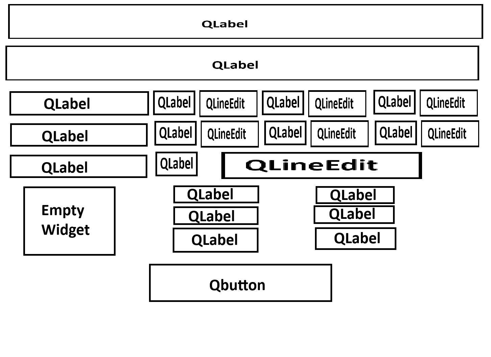
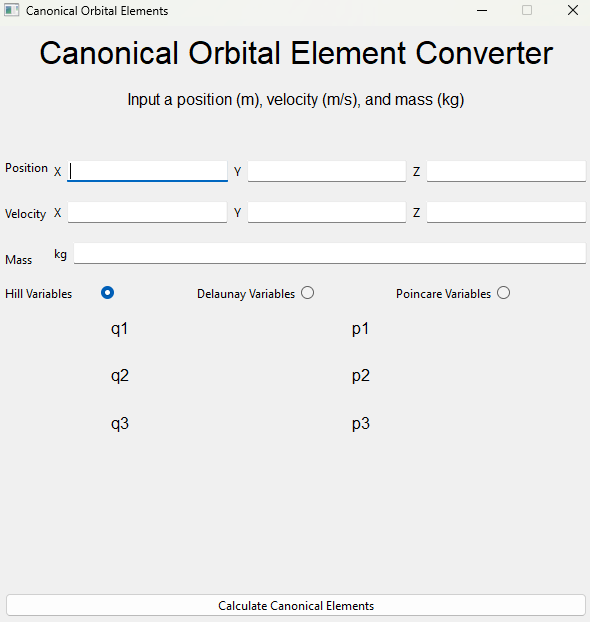
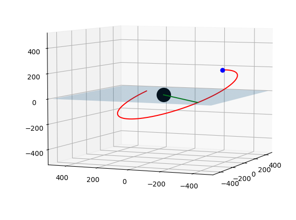
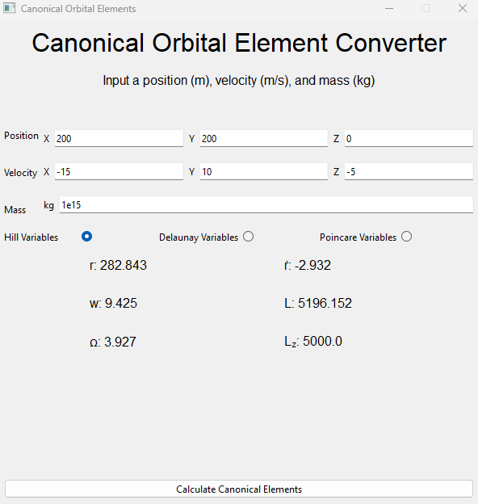
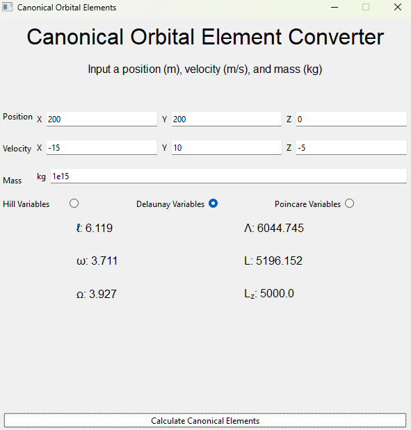
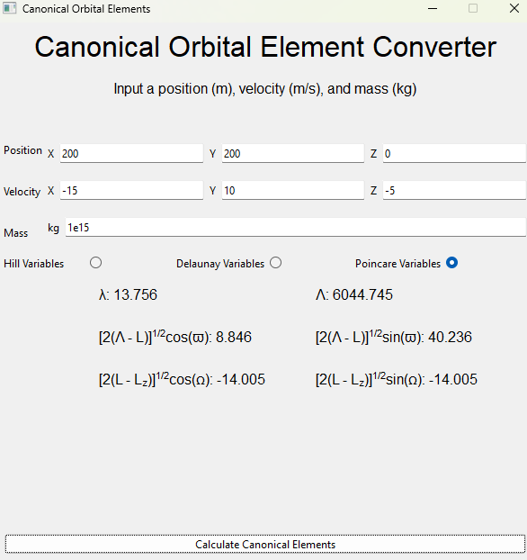

# Section 1.4 - Canonical Orbital Elements
This section introduces the Hamiltonian for Kepler orbits and talks about the results of doing so. Since many standard coordinate systems aren't the best when dealing with the average orbit, this section focuses on using the hamiltonian to use other canoical coordinates to work with that make understanding certain asepcts of orbits much simplier. Most of this section talks about the different types of canoical coordinates that can be used and their different generating functions. However, there are only two different named canoical coordinate pairs, and they are the Delaunay variables and the Poincaré variables. This book goes into a bit more detail surrounding some of these canonical coordinates (such as their consequence on the hamiltonian and some extra definitions for new terms), but for the most part, this is majority of the section.

| Subsection of Document | Description of Subsection |
| -----------------------|---------------------------|
| [Self Imposed Exercises](#self-imposed-exercises) | An outline of any exercises I thought would be beneifical or fun to work through that relate to the section of the book, usually exercises I make for myself. |
| [Project Description](#project-description) | A description of the coding project I designed for this section of the book, as well as any relevant information I used. |
| [Concluding Thoughts](#concluding-thoughts) | Reflective thoughts about the chapter itself, the self imposed exercises I worked through, and the coding project I made for the section. |

## Self Imposed Exercises
Since most of this section was focusing on canonical coordinates using the orbital elements and what they are, there wasn't too much that was left as an exercise to the reader. However, there is an extra little bit of work I wanted to get some practice in for this section. During this section, the book gives 5 different sets of canonical coordinates, as well as their generating function. I thought it would be fun to derive them and get some practice working with generating functions (since I am fairly certain I never saw them during my undergraduate studies). 

However, I am ***not*** going to be deriving the first set of canonical coordiates, which are the Delauney variables. This is mostly because I don't entirely understand their derivation, and the book just states what they are at the beginning. On a related note, I am only going to derive the first two coordinate sets. This is because there isn't any commentary for the book for the 3rd unnamed coordinate set, and after the first two unnamed sets, the process gets redundant and easy to see where it is going. Regardless, to make sure we're on the same page, here are the Delauney variables.

$$ 
\begin{aligned}
\ell, & \qquad \qquad \Lambda \equiv (GMa)^{1/2}, \\
\omega, & \qquad \qquad L = [GMa(1-e^{2}]^{1/2}, \\
\Omega, & \qquad \qquad L_{z} = L\cos(I).
\end{aligned}
$$

Before getting into the derivations, I would like to state a fact that is derived in the appendex about generating functions. If we have a generating function $S_{2}(\textbf{q}, \textbf{P})$, (where $(\textbf{q}, \textbf{p})$ are our initial coordinates and $(\textbf{Q}, \textbf{P})$ are the coordinates we're transforming to), then we have the following relation.

$$ \textbf{p} = \frac{\partial S_{2}}{\partial \textbf{q}}, \qquad \textbf{Q} = \frac{\partial S_{2}}{\partial \textbf{P}} $$

Now we can start deriving these sets of coordinates. First, each set has their own generating function and they are all derived from the Delauney variables. So for this case, we have $\textbf{q} = (\ell, \omega, \Omega)$ and $\textbf{p} = (\Lambda, L, L_{z})$. Now we just need a generating function.

### 1st Coordinate Set
For this one, we will use the generating function $S_{2}(\textbf{q}, \textbf{P}) = (\ell + \omega + \Omega)P_{1} + (\omega + \Omega)P_{2} + \Omega P_{3}$. It is rather straightforward to get $\textbf{Q}$, as the $\textbf{P}$ simplify nicely.

$$
\begin{aligned}
Q_{1} = & \frac{\partial S_{2}}{\partial P_{1}}  = \ell + \omega + \Omega \\
Q_{2} = & \frac{\partial S_{2}}{\partial P_{2}} = \omega + \Omega \\
Q_{3} = & \frac{\partial S_{2}}{\partial P_{3}} = \Omega
\end{aligned}
$$

The momenta have slightly more work, but nothing too bad either.

$$
\begin{aligned}
p_{1} = & \Lambda = \frac{\partial S_{2}}{\partial \ell} = P_{1} \\
p_{2} = & L = \frac{\partial S_{2}}{\partial \omega} = P_{1} + P_{2} \\
p_{3} = & L_{z} = \frac{\partial S_{2}}{\partial \Omega} = P_{1} + P_{2} + P_{3}
\end{aligned}
$$

From the first equation we have the following.

$$ P_{1} = \Lambda $$

Here we can substitue in this value into the second equation to solve for $P_{2}$.

$$ L = \Lambda + P_{2} \Rightarrow P_{2} = L - \Lambda $$

In the last one, we can substitue $L = P_{1} + P_{2}$ to solve for $P_{3}$

$$ L_{z} = L + P_{3} \Rightarrow P_{3} = L - L_{z} $$

Thus, are final canonical coordinate set is the following.

$$
\begin{aligned}
\lambda = \ell + \omega + \Omega, & \qquad \qquad \Lambda, \\
\varpi = \omega + \Omega, & \qquad \qquad L - \Lambda, \\
\Omega, & \qquad \qquad L - L_{z}.
\end{aligned}
$$

### 2nd Coordinate Set
For this one, we will use the generating function $S_{2}(\textbf{q}, \textbf{P}) = (\ell + \omega + \Omega)P_{1} - (\omega + \Omega)P_{2} - \Omega P_{3}$. Just as last time, let's get the $\textbf{Q}$ out of the way, as it is rather straightforward.

$$
\begin{aligned}
&Q_{1} = \frac{\partial S_{2}}{\partial P_{1}}  = \ell + \omega + \Omega \\
&Q_{2} = \frac{\partial S_{2}}{\partial P_{2}} = -\omega - \Omega \\
&Q_{3} = \frac{\partial S_{2}}{\partial P_{3}} = -\Omega
\end{aligned}
$$

Easy enough. Now it's fime for the momenta.


$$
\begin{aligned}
p_{1} = & \Lambda = \frac{\partial S_{2}}{\partial \ell} = P_{1} \\
p_{2} = & L = \frac{\partial S_{2}}{\partial \omega} = P_{1} - P_{2} \\
p_{3} = & L_{z} = \frac{\partial S_{2}}{\partial \Omega} = P_{1} - P_{2} - P_{3}
\end{aligned}
$$

From the first equation we have the following.

$$ P_{1} = \Lambda $$

For the second equation, we substitute this value in like we did last time to solve for $P_{2}$

$$ L = \Lambda - P_{2} \Rightarrow P_{2} = \Lambda - L $$

For the last equation, we can substitute $L = P_{1} - P_{2}$ and solve for $P_{3}$.

$$ L_{z} = L - P_{3} \Rightarrow P_{3} = L - L_{z} $$


Thus, are final canonical coordinate set is the following.

$$
\begin{aligned}
\lambda = \ell + \omega + \Omega, & \qquad \qquad \Lambda, \\
-\varpi = -\omega - \Omega, & \qquad \qquad \Lambda - L, \\
-\Omega, & \qquad \qquad L - L_{z}.
\end{aligned}
$$

### 3rd Coordinate Set (Poincaré Variables)
The last set of coordinates I want to derive is the Poincaré variables. The derivation for these are a bit more interesting, and they seem to have a strong application. The generating function we will be using for this derivation is $S_{2}(\textbf{q}, \textbf{P}) = (\ell + \omega + \Omega)P_{1} + \frac{1}{2}P_{2}^{2}\cot(\omega + \Omega) + \frac{1}{2}P_{3}^{2}\cot(\Omega)$

To being, let's start taking the partial derivatives for $S_{2}$

$$
\begin{aligned}
Q_{1} = & \frac{\partial S_{2}}{\partial P_{1}}  = \ell + \omega + \Omega \\
Q_{2} = & \frac{\partial S_{2}}{\partial P_{2}} = P_{2}\cot(\omega + \Omega) \\
Q_{3} = & \frac{\partial S_{2}}{\partial P_{3}} = P_{3}\cot(\Omega) \\
p_{1} = & \Lambda = \frac{\partial S_{2}}{\partial \ell} = P_{1} \\
p_{2} = & L = \frac{\partial S_{2}}{\partial \omega} = P_{1} - \frac{1}{2}P_{2}^{2}\csc^{2}(\omega + \Omega) \\
p_{3} = & L_{z} = \frac{\partial S_{2}}{\partial \Omega} = P_{1} - \frac{1}{2}P_{2}^{2}\csc^{2}(\omega + \Omega) - \frac{1}{2}P_{3}^{2}\csc^{2}(\Omega)
\end{aligned}
$$

Before we can begin solving for $\textbf{Q}$, let's focus on the 5th equation to solve for $P_{2}$ first. Isolating this equation and changing a term or two gives us the following.

$$ L = \Lambda - \frac{1}{2}P_{2}^{2}\csc^{2}(\varpi) $$

Now we can begin to solve for $P_{2}$.

$$
\begin{aligned}
L - \Lambda &= -\frac{1}{2}P_{2}^{2}\csc^{2}(\varpi) \\
2(\Lambda - L) &= P_{2}^{2}\csc^{2}(\varpi) \\
2(\Lambda - L)\sin^{2}(\varpi) &= P_{2}^{2} \\
[2(\Lambda - L)]^{1/2}\sin(\varpi) &= P_{2}
\end{aligned}
$$

From here, we can derive $Q_{2}$ using the second equation found when taking the partials.

$$ Q_{2} = [2(\Lambda - L)]^{1/2}\sin(\varpi)\cot(\varpi) \Rightarrow [2(\Lambda - L)]^{1/2}\cos(\varpi) $$

Awesome. Now we can do a similar algebraic process to find the last canonical coordiates. Using the last partial derivative equation, we can rearrange some terms to get the following.

$$ L_{z} = L - \frac{1}{2}P_{3}^{2}\csc^{2}(\Omega) $$

Now it's time to solve for $P_{3}$.

$$
\begin{aligned}
L- L_{z} &= \frac{1}{2}P_{3}^{2}\csc^{2}(\Omega) \\
2(L- L_{z})\sin^{2}(\Omega) &= P_{3}^{2} \\
[2(L- L_{z})]^{1/2}\sin(\Omega) &= P_{3}
\end{aligned}
$$

From here, we can derive $Q_{3}$ using the third equation found when taking the partials.

$$ Q_{3} = [2(L- L_{z})]^{1/2}\sin(\Omega)\cot(\Omega) \Rightarrow [2(L- L_{z})]^{1/2}\cos(\Omega) $$

Now that we have solved all of our variables, we have the complete set of Poincaré variables.


$$
\begin{aligned}
\lambda, & \qquad \qquad \Lambda, \\
[2(\Lambda - L)]^{1/2}\cos(\varpi),& \qquad \qquad [2(\Lambda - L)]^{1/2}\sin(\varpi), \\
[2(L- L_{z})]^{1/2}\cos(\Omega), & \qquad \qquad [2(L- L_{z})]^{1/2}\sin(\Omega).
\end{aligned}
$$

## Project Description
Since this section was focused mostly on canonical coordinates and their values, I thought it would be a fun idea to create a project around transforming a cartesean coordinate into a one of the helpful canonical coordinate sets. Like last time, I wanted to do this through a GUI instead of just having it print to the console. My biggest reasoning with this (and all times prior) is that I want these projects to feel like an actual program, and while the console is a perfectly valid tool, having a GUI to play with and use from the user's perspective makes it a bit easier for others who are not myself to actually use the program.

While I implemented the GUI last, I want to talk about it first and then go into the math behind the project. This is because I find the GUI slightly less interesting to talk about and I have less to say. However, there are a few extra bits I do want to mention for the GUI, as it is very different from the GUI in the previous two projects.

### GUI Creation
I put a tad bit more planning into making the GUI this time than I did last time, while also expanding on what I learned from previous projects. I have come to learn that I disliked the built in Tkinter for Python, so this time around I changed to using the PyQt6 library to make my GUI. This came with a lot of learning, but I feel like I was able to make a much smoother GUI (even if it didn't look like much had changed). For this GUI, I also planned out the GUI ahead of time instead of rushing into it, mostly because I had to. The layout I ended up going with was a combinaiton of nested horizontal and vertical box spacing that took the following form.

<p align = "center">

</p>

Please ignore the scrunched text, I never promised about being a good digital artist or good at using MSpaint. However, this shows the general form that I based building my GUI out of when I was making it in code. The code itself isn't too exciting, hence why I'm not referencing it explicitly, but after a lot of perserverience I was able to make it look manageable. Below you can see the final GUI that I ended up making for the project itself. This version is what greets the user when running the program and gives brief instructions on how to work it. Unlike my previous iterations, this one can work multiple times in a row (you don't need to reset the program), and you can press tab to move to the next text field. 

<p align = "center">

</p>

On a final note, the canoncial orbital elements only work with bound orbits (I believe, since a could aren't defined for hyperbolic or parabolic orbits as far as I know), so there is a checker to determine if the input is an elipical orbit. This checker / error only shows up when a wrong input is used and asks the user to try again. It is not seen in the image above as there is no input in said image.

### Calculating the Canonical Orbital Elements
The other half of this project was focused on creating a method to find all of the canonical orbital elements I wanted to calculate. For this project, I wanted to calculate three: the Hill variables, Delauney variables, and the Poincaré variables. However, a lot of work needs to be done before actually calcuating these, because I need to find the non-canonical orbital elements first. Most of these we already have from previous projects, but not all of them such as the **inclination**, **longitude of the ascending node**, and the **argument of periapsis**. In the previous project, I ended up having to type up two sets of functions to calculate some of the orbital elements, and truthfully, I didn't want to keep doing this again and again for the future. To fix this problem, I created a new Python Helper file to solve this issue so that I could use these functions in the future without having to re-type them.

#### Orbital Elements Helper File
This helper file ended up being the bigger half of the project when compared to the GUI, simply because of how much stuff I had to put in it. As mentioned before, this file is used to calculate the non-canonical orbital elements: semi-major axis $a$, eccentricity $e$, inclination $I$, longitude of the ascending node $\Omega$, argument of the periapsis $\omega$, and the mean/true anomaly $\ell / f$ (depending on what you need). The process outlined in the project in the previous section gave me half of these (namely $a$, $e$, and $\ell$), but we need a bit more in order to find the rest. Before getting into the math itself, I want to talk about what the givens are. The program takes in a mass, and cartesean starting position and velocity, so this is all we have to work with. With this in mind, here are the steps I used in order to find all 6 orbital elements.

1. Compute $r_{0} = |\mathbf{r_{0}}|$ and $v_{0} = |\mathbf{v_{0}}|
2. Use the relation $\frac{1}{a} = \frac{2}{r} - \frac{v^{2}}{GM}$ to find the value of the semi-major axis
3. Use the semi-major axis to find the mean motion using the definition $n^{2}a^{3} = GM$
4. Use the inital conditions to find the angular momentum $\mathbf{L} = \mathbf{r_{0}} \times \mathbf{v_{0}}$
5. Use the semi-major axis and magnitude of the angular momentum to find the eccentricity ($L = GMa(1 - e^{2})$)
6. Find the dot product between the angular momentum and the unit z vector to find the inclination of the orbit
7. Use the semi-major axis, eccentricity, and $r_{0}$ to find the initial eccentric anomaly using $r = a(1 - e\cos(u))$. Determine which hemisphere $u$ is in, based on whether $\mathbf{\dot{r}}$ is increasing or decreasing
8. Use the initial eccentric anomaly to determine the mean anomaly using Kepler's equation $\ell = u - e\sin(u)$
9. Use the relation $\cos(f) = \frac{\cos(u) - e}{1 - e\cos(u)}$ to find the initial true anomaly $f$. The hemisphere of $f$ is determined by the hemisphere of $u$.
10. Use the initial true anomaly and plug in a value of $f = 0$ to Gauss's $f$ and $g$ funciton, as well as their time derivatives.
11. Use the values from the previous step in combinaiton with the initial starting position and velocity to determine the position and velocity of the periapsis in cartesean coordinates.
12. Use the equation $r_{z} = \sin(I)\sin(f + \omega)$ to determine the value of $\omega$
    1. Use the z coordinate of the position of periapsis for $r_{z}$
    2. Since this position is at the periapsis, $f = 0$, and thus the second sine is simply $\sin{\omega}$
    3. Use the value found for inclination and solve for $\sin{\omega}$
    4. Take the inverse sine to find $\omega$
    5. If the resulting angle is positive, then $\omega$ is between $(0, \pi)$ and if the resulting angle is negative, then $\omega$ is between $(\pi, 2\pi)$
    6. Using the z coordinate of the velocity $v_{z}$ for the periapsis to determine the quadrant for $\omega$. If $v_{z}$ is positive, then $\omega$ is in quadrants I or IV, if it is negative then $\omega$ is in quadrants II or III.
13. Since the argument of the periapsis is the true anomaly difference between the periapsis and the ascending node, use this difference in angle for true anomaly and plug it into Gauss's functions
14. Use the value from the previous step to determine the cartesean position of the ascending node
15. Find the angle between the ascending node position and unit x vector using the dot product, and determine the hemisphere based on the sign of the y value

Whew, and that's it. Truthfully, finding out how to actually find the longitude of the ascending node was more difficult than the self imposed exercises I ended up doing. Because of this, I wanted to actually check my work to make sure it gave me the correct value. To do this, I created a new Python file which had a small copy of my work from the previous project with an added semi-transparent xy-plane and a line that pointed to my calculated ascending node. I ran the program to see if the orbiting partical ascended through this plan at the point and sure enough it did. This can be seen in the image below.

<p align = "center">

</p>

Running a couple tests and seeing that it provides me with a correct result doesn't mean it is entirely true, but I am rather convinced that this is working enough to move on.

#### Calculating the Hill Variables
The biggest reason I added the Hill variables is because someone thought they were important enough to name, that they were important enough to be used. Since most of the hill variables are related to the orbital elements, it wasn't a terribly difficult task. Here is the function I made that calculates the Hill variables for a given starting position and velocity in an orbit around a mass.

```python
def calc_hill_variables(start_r: vectors.Vector3D, start_v: vectors.Vector3D, M: int) -> list:
    r_mag = start_r.magnitude()
    temp_r = start_r.copy()
    temp_r.add(start_v)
    r_dot = temp_r.magnitude() - r_mag

    a, e, incline, ascending_node, arg_of_peri, l = calc_orbital_elements_l(start_r, start_v, M)
    ang_mon = calc_ang_mom_mag(start_r, start_v)

    ecc_anom = calc_eccentric_anomaly(l, e, 1e-10)
    true_anom = calc_initial_f(e, ecc_anom)

    return [r_mag, arg_of_peri + true_anom, ascending_node, r_dot, ang_mon, ang_mon*np.cos(incline)]
```

I believe that most of the naming conventions should make intuitive sense, but there are a couple I wanted to explain. The last function ```calc_initial_f``` is simply calculating the initial true anomaly, and the ```calc_orbital_elements_l``` is calculating the orbital elements using the mean anomaly instead of the true anomaly. One asepct I was unsure about was finding $\mathbf{\dot{r}}$ as I simply took the difference in magnitude of the position vector before and after applying the velocity vector. Looking back, I should have just used the equation for radial velocity, but the project is done, and I don't want to change it. Regardless, the resulting output for the Hill variables looks like the following.

<p align = "center">

</p>

#### Calculating the Delauney Variables
These are the main variables for this section, as they were the ones in which all other canonical coordinate sets were derived from, including the Poincaré variables. These were very easy to calculate, as each of these variables are simply in terms of the non-canonical orbital elements we all know and love. The code I made to calculate these is shown below.

```python
def calc_delaunay_variables(start_r: vectors.Vector3D, start_v: vectors.Vector3D, M: int) -> list:
    a, e, incline, ascending_node, arg_of_peri, l = calc_orbital_elements_l(start_r, start_v, M)

    cap_lambda = np.sqrt(G*M*a)
    ang_mom = calc_ang_mom_mag(start_r, start_v)
    ang_mom_z = ang_mom*np.cos(incline)

    return [l, arg_of_peri, ascending_node, cap_lambda, ang_mom, ang_mom_z]
```

Like last time, the ```calc_orbital_elements_l``` is calculating the orbital elements using the mean anomaly instead of the true anomaly. As a comparison, I wanted to show the application of this in the GUI, and with using the same initial conditions as I did with the Hill variables.

<p align = "center">

</p>

#### Calcuating the Poincaré Variables
The last named variables for this section, and from what I can gather, the more useful ones depending on the situaiton, as they are well defined when the Delauney variables aren't. Like the Delauney variables, the calculation for the Poincaré variables is rather straightforward once you have the orbital elements. My code for calculating them is shown below.

```python
def calc_poincare_variables(start_r: vectors.Vector3D, start_v: vectors.Vector3D, M: int) -> list:
    a, e, I, ascend_node, arg_of_peri, l = calc_orbital_elements_l(start_r, start_v, M)
    ang_mom = calc_ang_mom_mag(start_r, start_v)
    ang_mom_z = ang_mom*np.cos(I)

    q1 = l + arg_of_peri + ascend_node
    p1 = np.sqrt(G*M*a)
    q2 = np.sqrt(2*(p1 - ang_mom))*np.cos(arg_of_peri + ascend_node)
    p2 = np.sqrt(2*(p1 - ang_mom))*np.sin(arg_of_peri + ascend_node)
    q3 = np.sqrt(2*(ang_mom - ang_mom_z))*np.cos(ascend_node)
    p3 = np.sqrt(2*(ang_mom - ang_mom_z))*np.sin(ascend_node)

    return [q1, q2, q3, p1, p2, p3]
```

Like last time, the ```calc_orbital_elements_l``` is calculating the orbital elements using the mean anomaly instead of the true anomaly. As a comparison, I wanted to show the application of this in the GUI, and with using the same initial conditions as I did with the Hill and Delauney variables.


<p align = "center">

</p>

## Reflecting Thoughts
### Section 1.4 Thoughts
Overall, this section was both rather easy and very difficult to get through. The section started off with talking about the Hamiltonian equation of motion, which was rather straight forward and then went into talking about canonical coordinates for the orbital elements. I didn't remember a lot of the hamiltonian, so I went to the appendix for a refresher. Most of this was fine, until I got to the "propegator" section, where I am very certain I did not learn that in my undergraduate studies. This is where the book tended to lose me, especially when it came to deriving the Delauney variables. I read through that section, and truthfully only kind of understood it. After getting to the end, I figured that this was just background context should I want it, and went back to reading the actual chapter (especially since I was spending *a lot* of time in the appendix and trying and failing to look stuff up).

However, the rest of the chapter was rather straightforward, and a lot simpler to get through. Once you have the Delauney variales, the rest comes rather easy. The book gives you the generating function for each coordinate set, and it is pretty straightforward how to get these coordinates from the generating functions. Speaking of the generating functions, I am still a bit unsure where they specficially come from. I know that they have to be a function of some combination of the canonical pairs, but it looks like you can make the function itself whatever you want as long as it's well defined? Truthfuylly, I am not sure, and I am fairly certain that there is more reason behind it, but I failed at finding one. Overall though, the section itself (and only the section), was rather easy to get through.

### Self Imposed Exercises Thoughts
When I was thinking about what exercises to do for this section, I really felt like I was scraping the bottom of the barrel. Going in, I was worried that this wasn't going to be a good enough exercise or even fruitful to do, but the alternative exercise (deriving the Delauney variables) was way harder than I think I was ready for. I ended up going with this, and I think it was a good choice. I got over the whole "not hard enough of a challenge" part by remembering that my first self imposed exercise was proving conservation of energy and angular momentum. It's funny how quickly my own standards are drifting and wanting to be "harder" before they actually count as an exercise, especially when I'm doing these without any prompting. 

The exercise itself was honestly kind of boring. The first two coordinate sets were so easy I didn't even sketch out the solution before typing them in this document. Deriving the Poincaré variables was rather exciting and required more thinking than the first two. This is a big reason I didn't include the last canonical coordinate pairs, as they would be more of the same as the first two and I was really starting to get bored. However, I was able to learn a lot about formating for these exercises. I recently figured out how to center multiple math lines in the markdown file and I was able to play around with that a lot through these exercises. I believe that this makes the file look a lot nicer and I'm rather happy with how it looks. There is a big difference between how this file looks (in this section I mean) compared to previous ones, where everything is just centered and looks kind of jank.

### Project Thoughts
I hate making a GUI. So far, it is my least favorite part about making these projects. I switched from Tkinter to PyQt6, and I believe this helped a little bit, but making a GUI takes so long, and there is just so much tweaking, and it's not fun. I am happy with how the GUI turned out for this project, but I can still see it needs work. I believe that most of the problem is I don't really know how to make a GUI, and for some reason it's hard to learn a good way to do it. For this project, I had to us ChatGPT to get a proper understanding of how nested layouts work just because so much of what I read online was so confusing. I am not sure what I am going to do in the future, but I want this to be an easier task going forward.

The rest of the project was fun and actually pretty beneficial. I was worried that I wouldn't get a lot out of this project, since the idea seemed very easy, but I ended up learning a lot. Tring to find the last few orbital elements was a decent enough exercise of trying to pull together all of the concepts from the chapter together to solve for them. On top of this, I felt rather accomplished when I finished finding them all, and I am really happy with the helper file I ended up making, but man did it take a while. I didn't even add everything I could have, only what I needed (as I figured I could add more if I needed it in the future). An example of this is the partial time derivatives for the Gauss's functions in terms of eccentric anomaly. Techncially those should be in there, but I didn't need them so they aren't. Overall, finishing this file felt very rewarding, and even if I don't use these functions again, I still have it as a learning experience.

I am really happy with the general learning for this project overall. I found out I could simply access my helper files from the directory itself, so I stopped using localized helper files and just changed the ones in the Helpers directory instead. Another helpful coding experience I added this time around was type hinting. This ended up making my function headers very long, but I love how it looks now. All of the functions are much cleaner and it is slightly easier to catch myself giving a function an incompatible datatype. On the off chance, anyone actually reads this code, I hope the type hinting helps them read the situaiton as well. Overall, I'm really happy with how this project turned out, and even if there are more features to add or bugs to fix, I am going to move on.

### Concluding Thoughts
Truthfully, I was surprised how much I was able to learn from this section, not just in content with the book, but also coding and markdown editing. My commits from here on out are going to go down, because I recently discovered the "Preview" button. Now I don't have to commit my changes to make sure each edit is what I want it to be. The more important part of this particular section that is a bit unseen is how long it actually took me to finish. This wasn't because it was difficult to do, but simply more so because I was so unmotivated without a project idea. I spent around a week trying to come up with a project idea only to be a little dissatisfied when I did come up with the idea. I am glad I went through it, but not being able to come up with an idea really activated the breaks on this project overall.

Moving forward, I think I need to get more comfortable either doing smaller projects when the section doesn't contain substantial content, or just not doing a project at all. I am trying to think ahead, because the next section is about units and reference frames, and I do not have an idea for what that will be about. I don't want this next section to lead to another halting of progress either, so I need to figure out what I am going to do. Overall, I am really happy with how this turned out, even if it is hard to explain how nicely everything came together. It's projects like this that make me think I could do something more and have a massive long term project if only I had an idea. As always, there is more I could add or tweak, but if I spend time trying to make everything perfect, I'll never move on or even have a chance at finishing the overall project. Time to move on to Section 1.5!
