# Section 1.6 - Orbital Elements for Exoplanets
This section focuses on exoplanets, and what orbital elements that we can find using the different methods of exoplanet detection. Each method of detection has a rather detailed explanation about what information is given using observations and provides a small bit of background when it comes to trying to find exoplanets in the first place. In addition to this, there is also mention of the limitations of each method and what we cannot detect or measure. The book goes over four different methods for exoplanet detection: radial velocity method, transiting planet method, astrometry method, and direct imaging method. Graviational microlensing is mentioned as a method but not focused on in this section as it doesn't provide us many constraints for the orbital elements for the exoplanets. 

| Subsection of Document | Description of Subsection |
| -----------------------|---------------------------|
| [Self Imposed Exercises](#self-imposed-exercises) | An outline of any exercises I thought would be beneifical or fun to work through that relate to the section of the book, usually exercises I make for myself. |
| [Project Description](#project-description) | A description of the coding project I designed for this section of the book, as well as any relevant information I used. |
| [Reflecting Thoughts](#reflecting-thoughts) | Reflective thoughts about the chapter itself, the self imposed exercises I worked through, and the coding project I made for the section. |

## Self Imposed Exercises
When first reading this section, the parts that confused me the most were the astrometry and direct imaging coeffients, as they are mostly just stated. Assuming you can determine the wobble of a star or directly observe a planet, you can fit them the equations given and find a best value for A, B, F, and G. From there it's a matter of solving for the orbital elements once you have them. However, I wasn't sure where these coefficents come from, so I figured it that was a good place to start when it came to the self imposed challenges. For this particlar part of the file, I'll go through both the astrometry coeffients as well as the direct imaging coefficents.  

## Project Description
Since this section focused on what orbital elements we can determine from the different methods of exoplanet detection, I thought it would be fun to showcase what some of these methods looked like. I still wanted to implement the actual orbital elements though, so for each detection method I showcased, I also showed what orbital elements can be determined from them. Due to the book not including micorlensing as a method to focus on, my project implements the radial velocity, transit, astrometry, and direct imaging methods. Like in previous projects, I wanted to create a GUI to make it more digestible of a program for users.

My main goal for this was to have the user create their own two body system, and then pick their detection method from there. This does come with a weird side effect, where in order to give the stats of a system, you will already know the orbital elements of the exoplanet. However, this is a showcase, not to be used directly as a tool for any future projects. Going this route means I need to use a different method for finding the orbital path of the system. Since we're not just using an initial starting positiong and velocity, we have to go about it through a different method. To help with this task, I created a new Python file named `two_body_system.py`.

### Helper File: `two_body_system.py`
The first part of this file I want to mention is the `AstroBody` class. This is mostly just used as a glorified list, as this class doesn't contain any methods, and simply stores the mass and radius of an celestial body (star, planet, etc.). I also gave the class a position attribute, however this is never used. The code for the class can be seen below.

```python
class AstroBody:
    def __init__(self, mass: float, radius: float):
        self.mass = mass
        self.radius = radius
        self.position = v.Vector3D(0, 0, 0)
```

The real meat and potates of this Python file is the `TwoBodySystem` class. This class is meant to house any information or methods I might want that relates to a two body system. The constructor takes in six different parameters, namely the mass, radius, argument of periapsis, eccentricity, initial separation distance, and inclination. To make my life a bit easier, all orbits in this simulation start at periapsis. Another assumption is that the ascending node is simply always defined to be 0 radians. My justification to this is because for any system, since the line of sight is always in the $z$-axis, we can rotate the $xy$-plane to simply have the ascending node along the positive $x$-axis. This of course doesn't translate well to real life (as in observations, we don't know the orientation of the system right off the bat), but it is fine for this showcase. Using this method also helps keep the argument of periapsis defined when inclination is 0 when it otherwise wouldn't be.

The constructor for this class does a decent amount, and starts off by finding some important values for the system. It finds the period of orbit, the semi-major axis (used for the simplification to a one body system), and mean motion. This constructor also initializes a bunch of lists that will be used later. I'll showcase the code for the constructor below (minus the initalizations).

```python
    def __init__(self, body1: AstroBody, body2: AstroBody, init_sep_dist: float, eccentricity: float,
                 inclination: float, peri: float):
        self.body1 = body1
        self.body2 = body2
        self.eccentricity = eccentricity
        self.inclination = inclination
        self.semi_major_axis = init_sep_dist * constants.PhysicalConstants.au / (1 - self.eccentricity)
        self.period = self.calc_period(init_sep_dist * constants.PhysicalConstants.au)
        self.mean_motion = oe.calc_mean_motion(self.semi_major_axis, int(self.body1.mass + self.body2.mass))
        self.peri = peri
```

The process for finding the orbital path from these elements is as follows.
1. Create a time array with starting time 0 seconds and final time the length of the period with even interval spacing between them
2. Traverse through the time array and look at each specific time
3. For each time value, use the mean motion to determine the mean anomaly
4. Using the mean anomaly and eccentricity, we use Kepler's equation ot find the eccentricity anomaly, which is saved in its own list for later
5. Using the eccentric anomaly, we determine the value of the true anomaly, which is saved in its own list for later
6. Using the eccentric anomaly, semi-major axis, and eccentricity, determine the current separation between the two bodies using the one body simplificaiton
7. Transform the current separation along with the unit vectors of the celestial bodies to transfer the one body simplification to the current two body problem, which tells us the position for both bodies
8. These values are then saved in their own lists for later use.

Probably doesn't sound like a lot, but the code is rather gross, and a decent amount of steps. Regardless, I implemented these steps, and plotted my first orbit. I first did this in 2D istead of 3D (which made some aspects of my code a bit messier later on). The result can be seen below.

<p align = "center">
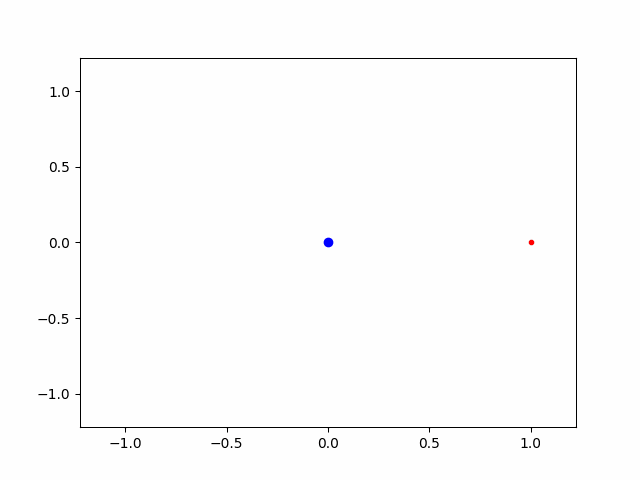
</p>

Overall, it doesn't look too bad. This is mainly due to 2D being a much simplier coordinate transformation than 3D. Next, I implemented the same code, but for 3D this time instead of 2D. I made some modifications of the code and then tried to plot the system from here. The result can be seen below.

<p align = "center">
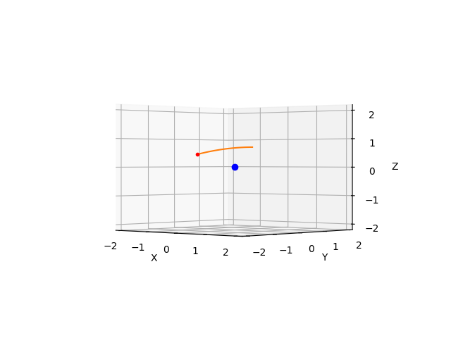
</p>

So this isn't correct. As you can see from the figure, the star is not on the orbital plane the exoplanet is orbiting on, and it isn't at the focus. This was annoying to fix, but I did find the bug. It came from a missing parenthesis when transforming to the cartesean 3D coordinate system. Fixing the issue the plot looks as it should.

<p align = "center">
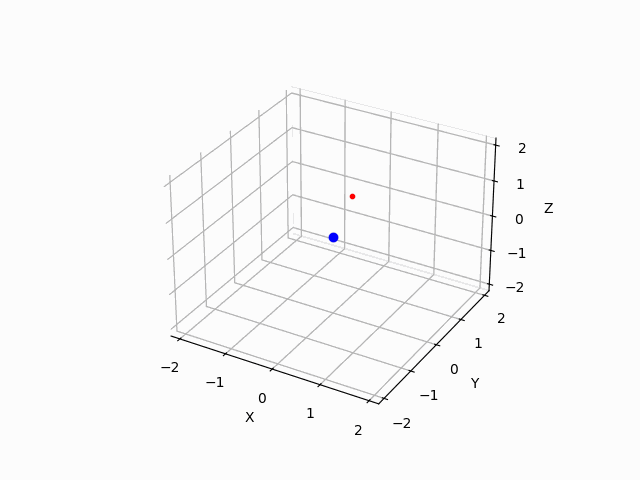
</p>

As you can see, this is a proper 3D orbit. One thing that can't be seen very well, but I can assure you is happening, is the wobble of the star (blue body). I did try these with similarly massed objects and the result is exactly what you would expect. I wanted to bring up the parenthesis problem earlier because this part happened a lot. My lack of organization this project led to a number of just typing things incorrectly and then spending too much time trying to fix it. Regarldess, here is the code for finding the orbtial path.

```python
    def fill_path_list(self, time: np.ndarray) -> None:
        total_mass = self.body1.mass + self.body2.mass
        for step in time:
            mean_anomaly = oe.calc_mean_anomaly(0, self.mean_motion, step)
            eccentric_anomaly = oe.calc_eccentric_anomaly(mean_anomaly, self.eccentricity, 1e-10)
            self.eccentric_anomaly_path.append(eccentric_anomaly)
            true_anomaly = oe.calc_true_anomaly(self.eccentricity, eccentric_anomaly)
            self.true_anomaly_path.append(true_anomaly)
            current_sep = self.calc_radius_eccentric_anomaly(self.semi_major_axis, eccentric_anomaly)

            current_pos = v.Vector3D(np.cos(true_anomaly + self.peri),
                                     np.cos(self.inclination) * np.sin(true_anomaly + self.peri),
                                     np.sin(self.inclination) * np.sin(true_anomaly + self.peri))
            current_pos.multiply(current_sep)

            body1_pos = v.Vector3D.multiply_scalar(current_pos,
                                                   -1 * self.body2.mass / (total_mass * constants.PhysicalConstants.au))
            body2_pos = v.Vector3D.multiply_scalar(current_pos,
                                                   self.body1.mass / (total_mass * constants.PhysicalConstants.au))

            self.body1_pos_x.append(body1_pos.x)
            self.body1_pos_y.append(body1_pos.y)
            self.body1_pos_z.append(body1_pos.z)
            self.body2_pos_x.append(body2_pos.x)
            self.body2_pos_y.append(body2_pos.y)
            self.body2_pos_z.append(body2_pos.z)
```

You can see the consequence of not using vectors at the bottom of the method. Since I was alternating between 2D and 3D, I just made lists for each of the axes for both bodies, when I really should have just made 2 lists full of vectors. Oh well. Lastly, there is much more to this class than I have talked about here. This is because most of the remaining methods deal with specific detection methods that I implemented later As we look at the different detection methods, I will elaborate on the specific part of this class for that method to keep things simple.

### Radial Velocity
Radial Velocity was the first detection method I decided to work on. All detection methods each have their own test file so that it was simply a matter of copy and pasting the result into `main.py`. Because of this, the beginning code for radial velocity can be found here, while the final polished code is in `main.py`. Since each detection method goes this route, I will not directly mention this again. 

My main goal for this method was to showcase the actual orbit of the two body system, and constrast it with another graph showing the line of sight velocity of the star that is moving at the same time the orbit is. This process is rather straightforward, especially since we already have a true anomaly list for the system that was derived from an interval of time equal to the period of the orbit. From here, it is simply a matter of making another list that houses the line of sight velocity. THe book dervies what this equation is and, for clarity, this equation can be seen below.

$$ v_{\text{los}} = - \frac{m_{1}}{m_{0} + m_{1}} \left[ \frac{2\pi G(m_{0} + m_{1})}{P}\right]^{1/3}\frac{\sin(I)}{(1 - e^{2})^{1/2}}\left[\cos(f + \omega) + e\cos(\omega)\right] $$

Adding this to a list wasn't too complex either. Using the true anomaly for a certain time value, I used the above equation to find the velocity in the line of sight. From here it is just as simple as plotting it over the period of the orbit. The code / methods that directly relate to this isn't entirely interesting, so I'll leave it to you to go through the files and look, but I do want to showcase the result upon plotting / animating this graph. While the axes aren't labeled (yet), you can see the orbit of the two body system on the left and the line of sight velocity on the right. The values for this make since given the initial conditions of the orbit.

<p align = center>

</p>

### Astrometry
The second detection method I focused on was astrometry, due to it mostly being rather simple and quick to make. The general idea behind this method is detecting the wobble of a star projected on the sky plane perpendicular to our line of sight, and how this changes over time. Given a full period, we can fit these to a linear combination of sine and cosine in terms of the true anomaly and determine the orbital elements based on the coeffients found. Since this project lives in a nice perfect world where we set the center of mass to be at (0, 0, 0), the equaiton we want to fit the star's projectoin of orbit to is as follows.

$$
\begin{aligned}
x_{0} &= -\frac{1 - e^{2}}{1 + e\cos(f)}\left(A\cos(f) + F\sin(f)\right) \\
y_{0} &= -\frac{1 - e^{2}}{1 + e\cos(f)}\left(B\cos(f) + G\sin(f)\right)
\end{aligned}
$$

Where $A$, $B$, $C$, and $D$ are the Thiele-Innes elements. What are these elements you might ask? Well you shouldn't. Go read the self imposed exercises. Regardless, because we already know the orbital elements of the exoplanet, we can find these elements pretty much exactly. Got to love the power of cheating. Regardless, having these values means it was rather easy to implement a graph that depended on time. I already had the true anomaly list, so I was able to use that to find a list for the $x$ and $y$ position of the star. Plotting this next to the orbit looked something like the following.

<p align = center>
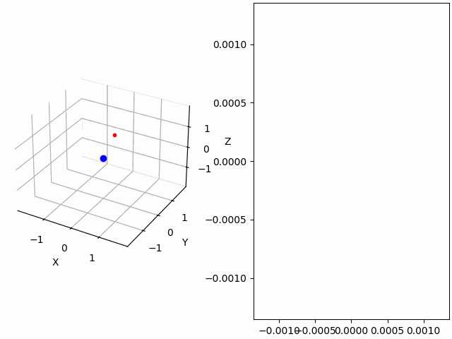
</p>

### Direct Imaging
The third detection method I focused on was direct imaging, mainly because it was very similar to astrometry. Direct imaging is probably the most self explanatory method of detection, as it just involves getting a high powered telescope, and observing the planet directly. In practice, this is rather difficult due to the star the planet is orbiting around being so much brighter than the planet itself. However, in this demonstration, we have a nice perfect telescope that can easily detect a planet, provided it's in our line of sight.

The actual process for determining the value for the orbital elements is the same as astrometry, but instead of looking at the star, we look at the planet. We observe the planet over the course of its orbit, and we fit this path to a linear combination of a sine and cosine. These values correspond to another slightly different Thiele-Innes elements. The book only provides these equations in terms of eccentric anomaly instead of true anomaly, and these equations can be seen below.

$$
\begin{aligned}
x_{0} &= A^{'}\left(\cos(u) - e\right) + F^{'}\left(1-e^{2} \right)^{1/2}\sin(u) \\
y_{0} &= B^{'}\left(\cos(u) - e\right) + G^{'}\left(1-e^{2} \right)^{1/2}\sin(u)
\end{aligned}
$$

Since we already know all of the orbital elements of the planet, we can simply plug in values for the Thiele-Innes elements and find an exact match. From here, it is a simple matter of plotting the $x$ and $y$ over time, but using the eccentric anomaly instead of the true anomaly. Fortunately, we found the eccentric anomaly while finding the true anomaly, so we already have a list containing these values that also depend on the time array.

<p align = center>
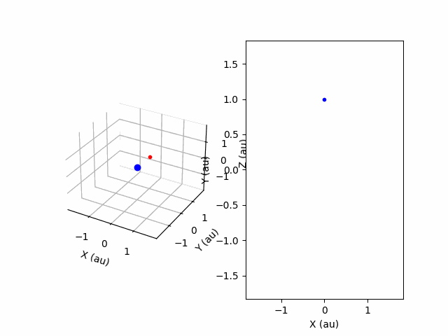
</p>

### Transit
The last detection method I wanted to showcase was the transit method. This process is done by measuring the change in the flux of the star when (if) the planet comes between our line of sight and the star itself. I saved this detection method for last, because it had the most amount of work to be put into it. My original goal was to do with the transit method exactly like I did before, but have three graphs instead of 2. I wanted one for the orbit of the planet, one for showing the planet coming in front of the star during its transit, and one that showed the measured flux of the star.

The way I initially started to implement this is by calculating the orbit of the two body system like before, and showing the planet moving across the star when it transits by calcuing when the planet's position from the cetner of mass was less than the sum of the star and planet's radius. This technically isn't always true, as I should also take into account the star's wobble, but I was trying to keep things simple for this project. It is already bloated enough as it is. Doing this process gave me the following result (ignore the blank plot, that was going to be the flux graph).

<p align = center>
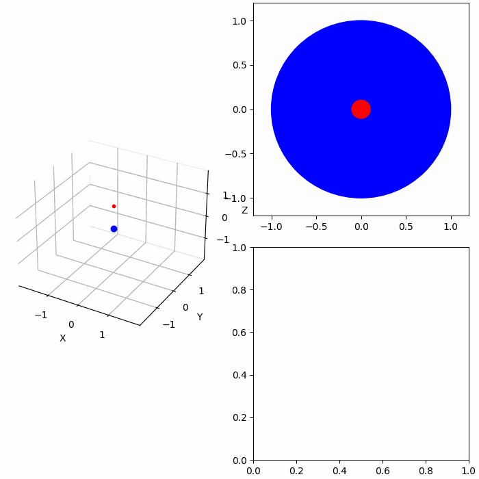
</p>

Truthfully, I should have realized that the planet's transit would be a very short portion of the actual orbit, but I didn't. Anyway, this process of showing this detection method wasn't going to fly, as I would either have to make the time so slow that the orbit takes forever to complete or make time move so fast you can't see the transit happening. Because of this, I decided to just scrap the graph showing the orbit and just have the plot of the transit and the flux. Don't worry, this was hard enough as it was. 

The first order of business was to find when the transit actually happened in the orbit. I could not figure out how to do this analytically, so instead I did this numerically. I went through the true anomaly list of the orbit and then found the position of the planet from that. If the $x$ and $y$ projection was less than the radius of the planet plus the radius of the star, then the planet was in transit. However, doing this can lead to a weird order. If the transit starts at the beginning of the orbit, then there will be a long period where there is no transit, and then it would finish the transit at the end. To fix this (to make sure everything was in the correct order), if there was a gap between points in the orbit where the planet was in transit, I stitched it to the front of the other section. The code for this process looks like the following.

```python
    def fill_temp_transit(self, time: np.ndarray) -> list[int]:
        temp_transit = []
        temp = []
        consec = 0
        for i in range(len(self.body2_pos_x)):
            x = self.body2_pos_x[i] * c.PhysicalConstants.au
            y = self.body2_pos_y[i] * c.PhysicalConstants.au
            z = self.body2_pos_z[i]
            r_planet = self.body2.radius
            r_star = self.body1.radius
            if x ** 2 + y ** 2 <= (r_planet * 1000 + r_star * 1000) ** 2 and z >= 0:
                consec += 1
                temp.append(i)
                if (i == len(self.body2_pos_x) - 1):
                    temp_transit.append(temp)
            else:
                if (consec != 0):
                    temp_transit.append(temp)
                    temp = []
                consec = 0
        if len(temp_transit) == 2:
            if (temp_transit[0][0] < temp_transit[1][0]):
                second_list = temp_transit[1].copy()
                temp_transit.pop(1)
                temp_transit.insert(0, second_list)
            temp_transit = temp_transit[0] + temp_transit[1]
        elif (len(temp_transit) == 1):
            temp_transit = temp_transit[0]
        return temp_transit

    def fill_transit(self, time: np.ndarray) -> None:
        temp_transit = self.fill_temp_transit(time)
        for index in temp_transit:
            self.transit_x.append(self.body2_pos_x[index])
            self.transit_y.append(self.body2_pos_y[index])
            area_of_star = pow(self.body1.radius * 1000, 2) * np.pi
            area_of_intersect = self.get_transit_intersection(self.body1_pos_x[index], self.body1_pos_y[index],
                                                              self.body2_pos_x[index], self.body2_pos_y[index])
            self.flux.append(1 - area_of_intersect / area_of_star)
            self.transit_time.append(time[index])
```

That is some gross code, but it works. The next point I want to bring up about making the transit plot is how I made the circles. Matplotlib technically has an object to make a circle (aptly named 'Circle'), but this ended up being a little jank and unreliable when it came to animating its change. My best solution to this was to effectively just change the marker size of the plot point to be relative to the size of the planet to the size of the star. Matplotlib also has a method that determines the dots per inch of a figure (dots being the unit of measurment for matplotlib) and scaled each object respectfully. This ends up having some problems, as the sizes almost depend on the size of the window. This means they work well enough for certain combinations and pretty well for the initial running of the code. This changes when you resize the window, as it messes with the size of the circles. The example for this is seen below.

<p align = center>
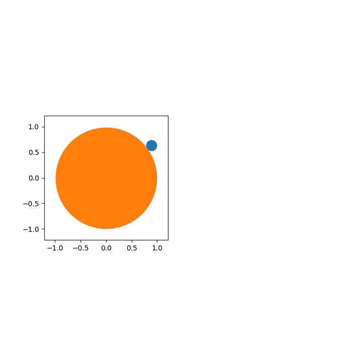
</p>

Another point of note is why the planet goes behind the star in this animation gif. I have no idea why this happens. When I tested it on my end, the planet would always be in front of the star and actually show the planet in transit. However, when I saved the file to a gif the planet would always go behind the star. I wasn't able to figure this problem out, so the visualizations will have to do for now, but just pretend the planet is going in front of the star. If you want to see the transit code actually working the way it's supposed to, you can run the code yourself using the files in the directory. 

The last part of this code I want to explain is how I estimated the flux difference from the star while the planet is transiting. The book mentions this decreases based on the part of the star that is covered by the planet. Based on this, we can simplify this down into just finding the area of the intersecting circles from the transit, then subtract that from the area of the circle made by the projection of the star. This gives us a general estimate, but forces our $y$ axis for this graph to be in terms of the star's flux. To make this work, I looked up the equation for the area intersected by two circles of different sizes and position. You might ask yourself why I didn't do this myself, which is a great question. The answer is because one of the book problems is asking this exact question, and I didn't want to cheat (they ask you to show it, but give you the equation), and I was not in the mood to solve a book problem right now. Plus I really wanted this transit code done. Regardless, the equaiton for area between two intersecting circles is the following.

$$ A = r_{1}^{2}\cos^{-1}\left(\frac{d^{2} + r_{1}^{2} - r_{2}^{2}}{2dr_{1}}\right) + r_{2}^{2}\cos^{-1}\left(\frac{d^{2} + r_{2}^{2} - r_{1}^{2}}{2dr_{2}}\right) - \frac{1}{2}\sqrt{(-d + r_{1} + r_{2})(d + r_{1} - r_{2})(d-r_{2}+r_{2})(d+r_{1}+r_{2})}$$

A very fun equation all around. Anyway, I used this to calculate the area of the intersection between the circles created from the projection of the star and the planet. From here, I subtracted this difference from the star's total area. It should be noted, this only works when there is some area that isn't being overlapped by the second circle, so for the case where the planet's circle is completely engulfed from the star, I just calculated the area of both, and subtracted the planet's from the star's. The code for this is exactly what you might expect, but managing a lot of terms.

```python
    def get_transit_intersection(self, x1: float, y1: float, x2: float, y2: float) -> float:
        r1 = self.body1.radius * 1000
        r2 = self.body2.radius * 1000
        dist = np.sqrt(pow(x1 - x2, 2) + pow(y1 - y2, 2)) * c.PhysicalConstants.au
        if (dist >= r1 + r2):
            return 0.0
        elif (dist <= np.abs(r1 - r2)):
            return r2 * r2 * np.pi
        else:
            term1 = pow(r1, 2) * np.arccos((dist * dist + r1 * r1 - r2 * r2) / (2 * dist * r1))
            term2 = pow(r2, 2) * np.arccos((dist * dist + r2 * r2 - r1 * r1) / (2 * dist * r2))
            term3 = 0.5 * np.sqrt(pow(2 * r2 * dist, 2) - pow(dist * dist + r2 * r2 - r1 * r1, 2))
            return term1 + term2 - term3
```

Beautiful. But everything pretty much works almost as much as I hoped. The resulting animation looks really good in my opinion and is one of my favorite out of all of the detections. It looks even better when the planet actually goes in front of the star, but I still like it a lot. Things can get crazy for this plot when you have a small-ish star and a large planet, but the one showcased below is a standard star and planet duo. One thing should be noted is by using this method, I ignored the effects of limb darkening and assumed that the flux at every point in the star is the same, which is not true in practice.

<p align = center>
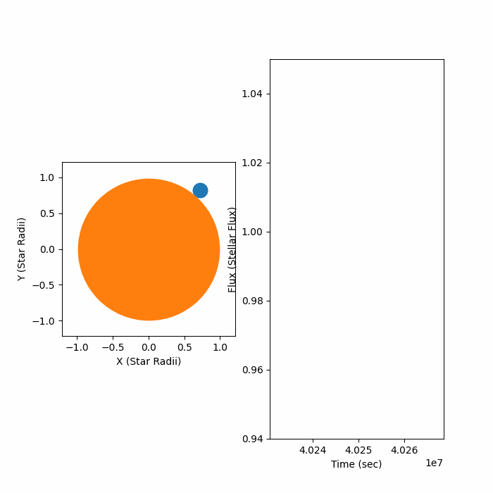
</p>

### The GUI
Like the project from Section 1.4, I ended up using the Python GUI library PyQt6. While it was a very frustrating task, I like this library a lot better than the tkinter default package that comes with Python. Unfortunately, I didn't plan this GUI ahead like I did the previous one, so I will just have to describe what my thought process was instead.

My second least favorite part of making the previous GUIs (tkinter included), was the error handling. Having to determine the exact values I wanted to see from a text box was not a fun task, and felt rather redundant at times. To fix this, I decided to add sliders instead so that way the input from the user is forced to be a certain data type. I also think this looks a lot cleaner. Next to each slider, I put a label for the name of the slider as well as the unit the slider was in (if it had a unit). At the bottom, I put four buttons to showcase the four different detection methods that will showcase them as well as the different orbital elements that can be found using this method. The user simply needs to input the information for the slider, and click a button, and this will show the detection method as was outlined above.

<p align = center>
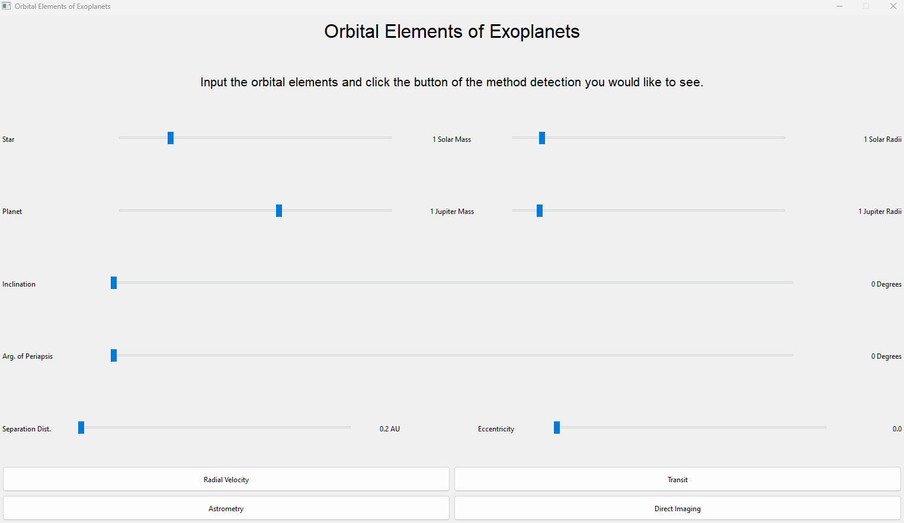
</p>

While it is a bit rough, I like how it looks. However, there was a slight problem that had to be addressed when making the sliders. Due to the nature of astrometry, both stars and planets vary widly in radius and mass, and most are similar to each other. For example, a 50 solar mass star will act mostly the same as a 51 solar mass star, but not the same as a 0.5 solar mass star. But implementing this on a linear scale is difficult as if I wanted to include large stars, I should also include the small stars, and having this be a linear scale would either make it impossible to choose the small stars, or make the scale way too large.

To compensate for this, the mass and radius sliders are scaled using an exopential equation rather than a linear one. This way, the lower values of the slider allow the user to pick the finer details between the smaller massed stars, while also not worrying about making the scale to big for stars where it doesn't matter (such as the difference between 50 and 51 solar masses). I did this by choosing three points I wanted to be on the sliders (lower limit, upper limit, and starting value) and solving for an exopential function. I won't show the scaling for every slider like this (mostly because I don't think it is important), but I will show the equation used for the star mass slider.

```python
    def mass1_update(self) -> None:
        cur_val = self.mass1_slider.value()
        cur_val = -0.4574 + 0.5604 * np.e ** (0.05189 * cur_val)
        self.mass1_unit.setText(str(round(cur_val, 1)) + " Solar Mass")
```

Another addition to this GUI that the previous projects didn't have is a back button. I used a stacked widget to make two different pages for this GUI, and used the different buttons to switch between the two. When a user clicks one of the buttons, it calculates a system and detection method for whatever was picked and showcases the plots on the second page, and then switches to the second page. Building it this way means that going to the home page is just as simple as moving to page one using the button provided. While it's a small addition, I am happy that the user doesn't need to continuously stop and start the program if they want to tweek their values.

Speaking of the second page, I am rather proud how this turned out too. Since each detection method had two plots, I formated the second page around that. There are two labels at the top to tell you want the graphs themselves are, the graphs themselves, and a 2 by 3 grid below that labels the different orbital elements determined from the detection method. Not all of the detection methods find all orbital elements, so in that case, I just put in as many as I could. Lastly, I couldn't figure out how I wanted to round my numbers for the different elements, so I just didn't. It makes things look a tad ugly, but I figure it was good enough.

|     |     |
|:---:|:---:|
|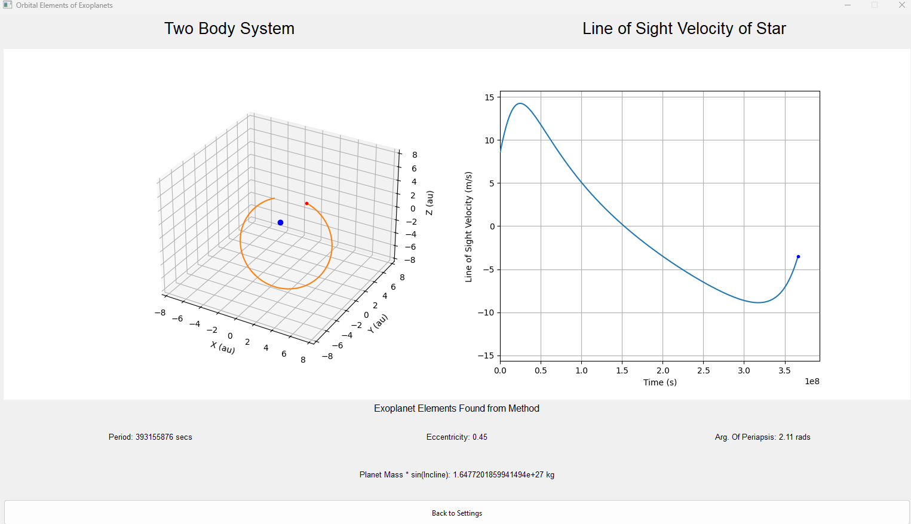|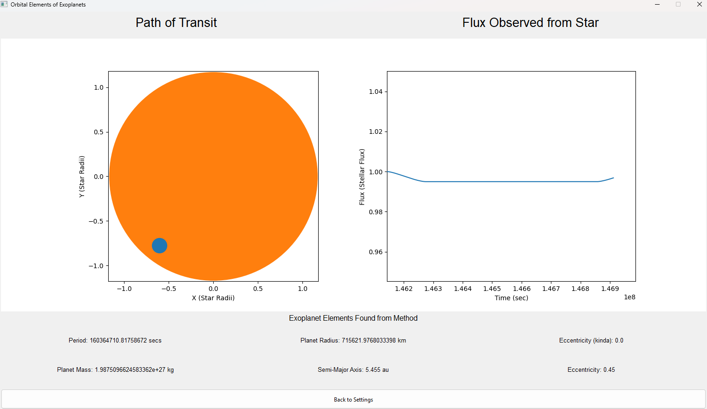|
|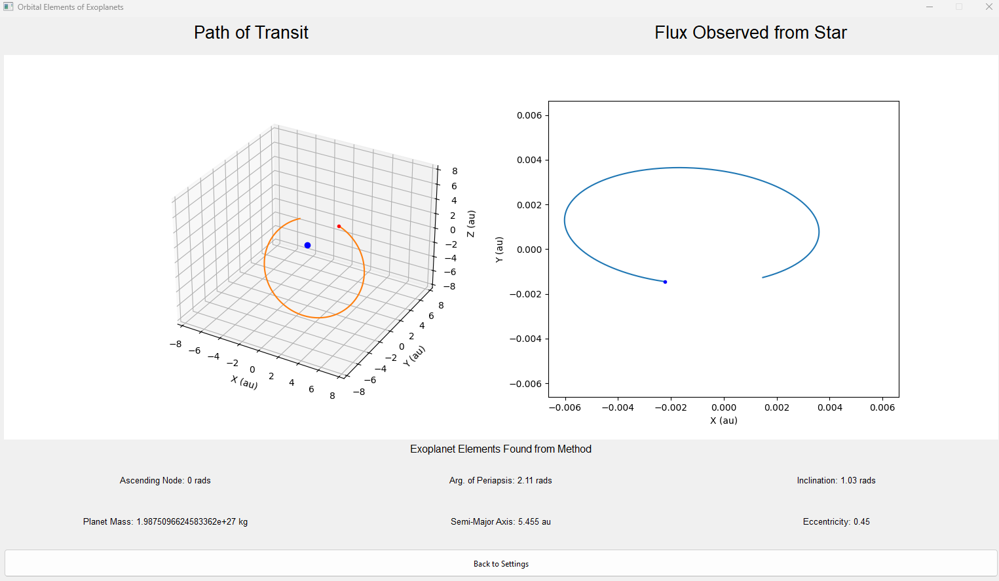|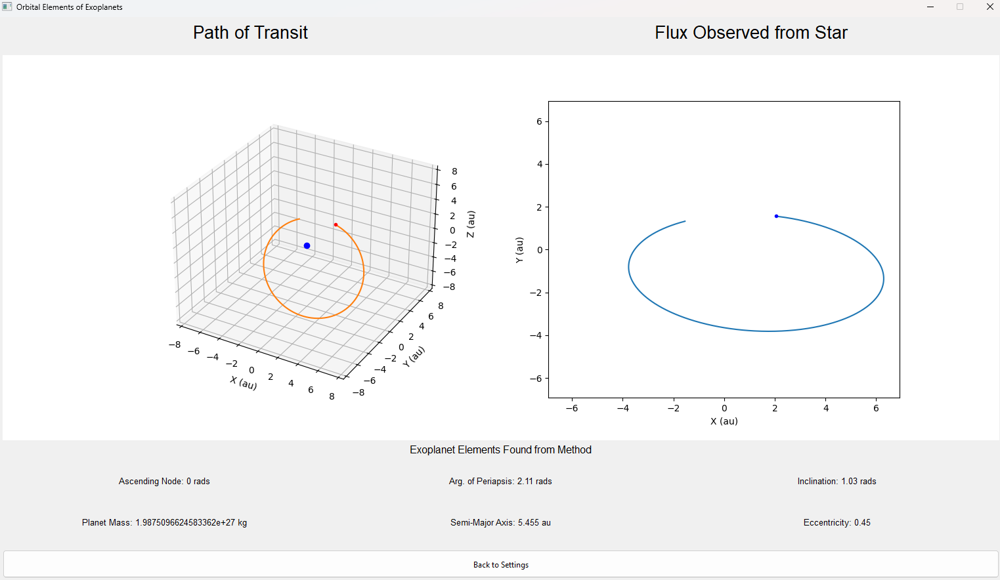|

Ignore the incorrect labels for the graphs on astrometry and direct imaging. I changed them in the final version of the code, but took the screen shots after. I was a bit lazy to make more screenshots because at this point I really want this project to be over so I can move onto the next one.

The last order of business I want to discuss (don't worry it'll be short) is the cases for which the detection will never work. For radial velocity, direct imaging, and astrometry, the data will give you something, it just won't be helpful. For example, in radial velocity, if the inclinaiton of the system is perpendicular to the line of sight, the star will not have any velocity in the line of sight, and thus, the graph will show a straight line. Similar things hold true for astometry and direct imaging but for different conditions. However, in the case of the transit detection method, there is simply nothing to show if a planet does not transit. Because of this, the transit method got a little bit of special treatment and I added in something for the cases if a transit is not possible. This can be seen below.

<p align = center>
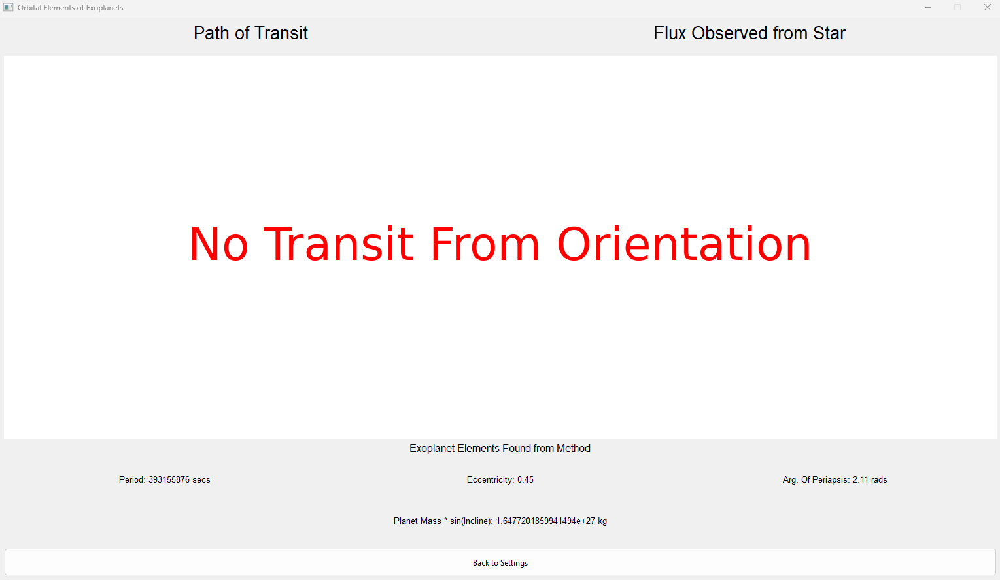
</p>

## Reflecting Thoughts
### Section 1.6 Thoughts
This section was a lot more digestable to get through than most of the previous sections, although I am slowly coming to the conclusion that I it is me warming up to the material. I do think I was a bit harsh in the beginning when I mentioned that there were jumps in the book, because these jumps would have been trivial to those who already know and have retained a lot of physics information. As someone who has been teaching computer science for 3 years and hasn't been in a physics class in 4 years, the start (I believe) was me being rather rusty, and I believe that this section showcases that well.

I believe that this section is probably the more conceptually difficult section, but it was easy to digest and following what was happening in each subsection of the book. The only part that lost me was the astrometry coefficents, and this was more so because there was a lot of stuff in those coefficents rather than me getting stuck on why they were what they were. Truthfully, I don't have too many interesting things to say about this section because of how straightforward it was to read and understand. I did enjoy this section a lot, as I'm really interested in exoplanet research as well as their general dynamics (hence why I have this book), so I was really excited to get to this moment. Overall, it was a fun chapter, and I look forward to many more to come.

### Self Imposed Exercises Thoughts
testhaha

### Project Thoughts
Hot damn that was a large project. I am currently writting this reflection right as I finished the project so that it is fresh in my mind, although I still might take breaks between paragraphs. This project was much larger than all of my other projects and you can tell if you look at the python code. The main file alone was about 650 lines of code, and the helper file I made for this project was about 300 lines of code too. I can definitely feel some bloating going on with these projects, as each new project I get excited about seems to be just ever so larger than the one before it (with the exception being Section 1.5). It probably didn't help that there was also a lot going on in this chapter, but looking back at it, I probably could have cut one or two of the exoplanet detection methods to save time.

Speaking of large files, let's talk about the helper file `two_body_system.py` which was both a large help to this project and a little bit of a hit on my ego. I am happy I am using OOP when I can, because actually using objects is making this much easier to organize everything, even if they just become glorified lists. However, the class `two_body_system` is extremely complicated and a mess. I made it as I went along and simply added stuff into it when I needed it, and now it is horrifically disorganized. One such example is the mish-mash of units for distances, as sometimes a variable is in meters while the other is in au. Making this file made me realize I should really try to plan these things ahead because there are methods all over the place and waaayyy too many attributes. It never became too much to keep track of, but I would want to clean that up in the future.

As much as I was not excited about the work I did during Section 1.5, I am glad I pulled through and actually did it. Having a file that just held all important constants is so much nicer as a reference that slowly importing and using the constants I need for each project. This especially helped when making my test stars and planets, as I could just reference the Sun's stats or real planet stats. While I didn't use too many of the constants, just having it there was so nice to have. Just goes to show that even adding some small helpers can make a big difference in the future. The only part I'm not proud of is the use of the shortening the filename to `c` when it was called. I didn't really have a better idea, but I didn't exactly like that choice either.

One of the things I am most proud of in this project is how the GUI looks. It isn't perfect, and even I sometimes confuse which slider is which for the two rows at the top, but I think it looks much cleaner than the GUIs that came before. It was also nice not having to work on error handling with the text boxes. I wish I had more good things to say about the GUI, because I truly am proud of it. That being said, this was by far my least favorite part of the project. If I have learned anything making these programming projects, it's that I hate making GUIs. It isn't fun, and trying to make everything fit in the right spot just sucks. I am not sure how I can make this process go smoother, but I have a feeling it might just not be possible without investing in a program to help with, but I really want to keep my expenses on these to a minimum (money spent so far: $0).

I was the most excited about the detection part when I started to make this project, but it more or less dwindled as I made it. Working on radial velocity was really cool, and I loved how it turned out. Then, when I started working on direct imaging and astrometry, I realized they were pretty much the same thing (just looking at a different object), and visually not much difference between than and the actual orbit (2D projection and all that). The worst offender was the transit method. It was interesting, and I'm glad I did it, but it was by far the most challenging. Even still there are a bunch of bugs that I'm hoping no one notices before reading this paragraph. One such example is the orbital path of the planet changes depends on the figure size (which changes for each computer), and it doesn't directly corrispond with the flux chart. I am not sure how to also make the flux chart a square without screwing with the units, but I didn't feel like fixing it. This was hard, but really cool when I was able to finish it.

Overall, this project was super long and rather indictative of a trend I am noticing with each section (except for Section 1.5). Each project is getting bigger and more involved than the last, and this is starting to take me a lot longer per section. It isn't entirely fair to compare time on this one (as this one took off near the end of break, so I had to complete it while doing my job), but this one took around 3-4 weeks. My python files are much larger and are way more involved than they normally are. While I am very happy with how this turned out, this project could be polished much more and could be a lot better. But I need to move on. Moving forward, I am going to try to limit how big these projects get, and be more okay with smaller projects such as the scope of Section 1.4 or Section 1.2.

### Conclusing Thoughts
last test
