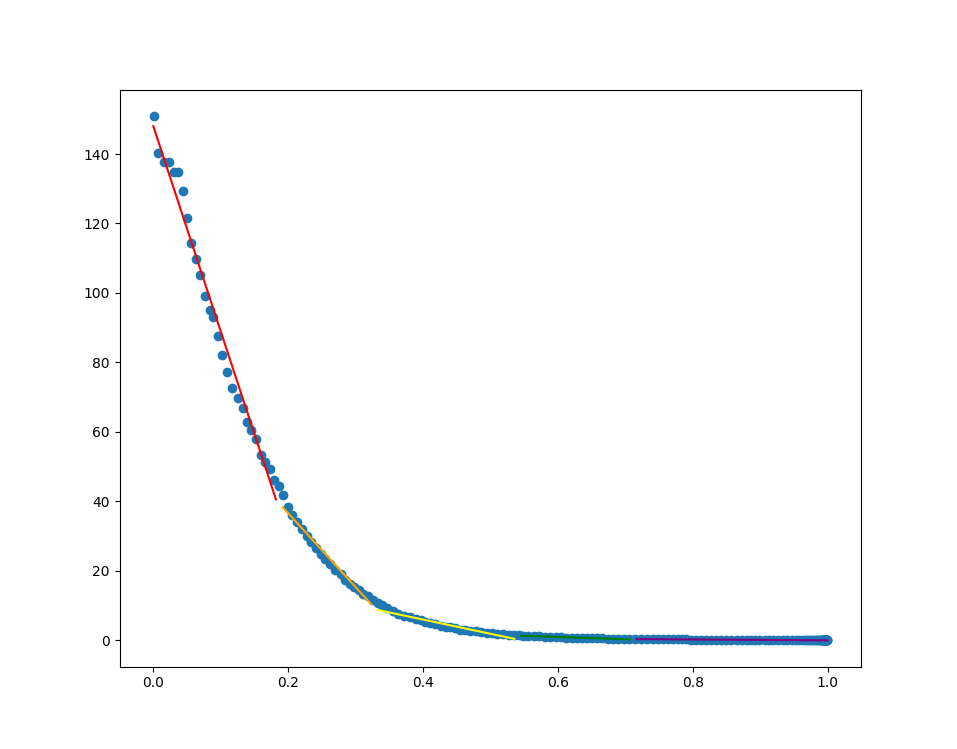

# Section 1.7 - Multipole Expansion of a Potential
This section focuses on expanding the graviational potential for a massed body. It starts with centering the coordinate system to the center of mass, and pointing out how we define graviational potential between two points, and over an object. The potential is then expanded using a taylor series, which is then re-written using associated Legendre Polynomials and Spherical Harmonics. Using these relations, the book showcases the equations for the graviational monopole, dipole, and quadrapole. From here, the book focuses on the quadrapole and what it actually means. It shows that for prefectly spherical objects, this value is 0, but for oblate objects (like most celestial bodies) this is non-zero and positive. The book briefly ends by talking about how the quadrapole showcases what happens due to rotational flattening.

| Subsection of Document | Description of Subsection |
| -----------------------|---------------------------|
| [Self Imposed Exercises](#self-imposed-exercises) | An outline of any exercises I thought would be beneifical or fun to work through that relate to the section of the book, usually exercises I make for myself. |
| [Project Description](#project-description) | A description of the coding project I designed for this section of the book, as well as any relevant information I used. |
| [Reflecting Thoughts](#reflecting-thoughts) | Reflective thoughts about the chapter itself, the self imposed exercises I worked through, and the coding project I made for the section. |

## Self Imposed Exercises
This section is focused primarily on the various multipoles for the graviational potential, with heaviy emphasis on the quadrupole moment. The book mentions that these are found through observations and the inertia of the rotating body, and Appendix A tells you what the values of these moments are for each planet (and the Sun). A large reason that the quadrupole moment (and the other multipole moments as well) aren't easily determined, is because you need a density function for the object in order to find the quadrupole moment (amongst other things). 

I thought it would be fun to derive some of these quadrupole moments, and calculate an approximation to these values. I was curious how the quadrupole moment changes with different density functions, and I also wanted to see how close I could get to the measured values. For this exercise, I first used a constant density function, and then made my own linear version which was fitted to the Sun's density distribution. After this, I found the quadrupole moment through its definition, and compared them to the actual values that have been measured.

### Quick Definition
Before jumping into the actual derivations, I first want to actually point out the definition for a multipole moment. Here is where the naming convention gets a bit confusing (for me at least). The multipole moment ends up relating to a degree of a Legendre Polynomial of degree $\ell$ where $\ell$ is the power of two that relates to the multipole. For example, for a monopole we have $\ell = 0$, for a dipole we have $\ell = 1$, for a quadrupole we have $\ell = 2$ and so on. For a degree $\ell$, the multipole for that $\ell$ is as follows.

$$ J_{\ell} = \frac{-1}{MR_{p}^{\ell}} \int_{V} \boldsymbol{\rho}(\mathbf{r})P_{\ell}(\cos(\theta))r^{\ell}dV $$

For this definition, we have $M$ being the mass of the object, $R_{p}$ being the nominal radius, $\boldsymbol{\rho}(\mathbf{r}))$ being the density function for the object, and $P_{\ell}(\cos(\theta))$ being the Legendre Polynomial. For this exercise, I only concerned myself with the quadrupole moment, and thus, I only really care about the case when $\ell = 2$. Using the definition outlined above, we have the following equation for the quadrupole moment.

$$ J_{2} = \frac{-1}{MR_{p}^{2}} \int_{V} \boldsymbol{\rho}(\mathbf{r})P_{2}(\cos(\theta))r^{2}dV $$

### Oblate Spheriod Equation in Spherical Coordinates
Before jumping into the quadrupole moment, we need to do a little bit of work determining the bounds for the radial variable. We can make our lives a bit easier, as a body isn't just some random ellipsoid, it's more closely approximated through an oblated spherioid. This means that we can consider just two maximum radii (semi-major and semi-minor values) instead of three. Since a celestial body is usually rotating around a polar axis, the semi-major axis ends up being the equatorial radius and the smei-minor axis is the polar radius.

First, we need to start off with the equation of an oblate spheriod (with semi-major axis in the $xy$-plane and semi-minor axis on the $z$ axis) in cartesian coordinates. To make things a bit clear, my specific spherical coordinates system is $r$ for radial distance, $\varphi$ for azimuth / equatorial angle, $\theta$ for polar angle, $a$ for semi-major axis, and $c$ for semi-minor axis.

$$ \frac{x^{2} + y^{2}}{a^{2}} + \frac{z^{2}}{c^{2}}  = 1 $$

Now, we use the tradiational spherical coordinates for $x$, $y$, and $z$.

$$
\begin{aligned}
x &= r\sin(\theta)\cos(\varphi) \\
y &= r\sin(\theta)\sin(\varphi) \\
z &= r\cos(\theta)
\end{aligned}
$$

To determine the bounds for the radial distance, we need to plug in these values for $x$, $y$, and $z$ and solve the resulting equation for $r$. 

$$
\begin{aligned}
\frac{(r\sin(\theta)\cos(\varphi))^{2} + (r\sin(\theta)\sin(\varphi))^{2}}{a^{2}} + \frac{r^{2}\cos^{2}(\theta)}{c^{2}} &= 1 \\
\frac{r^{2}\sin^{2}(\theta)\left[\cos^{2}(\varphi) + \sin^{2}(\varphi)\right]}{a^{2}} + \frac{r^{2}\cos^{2}(\theta)}{c^{2}} &= 1 \\
r^{2}\left[\frac{\sin^{2}(\theta)}{a^{2}} + \frac{\cos^{2}(\theta)}{c^{2}}\right] &= 1 \\
r^{2}\left[c^{2}\sin^{2}(\theta) + a^{2}\cos^{2}(\theta)\right] &= a^{2}c^{2} \\
r^{2}\left[c^{2}\left(1 - \cos^{2}(\theta)\right) + a^{2}\cos^{2}(\theta)\right] &= a^{2}c^{2} \\
r^{2}\left[c^{2} - c^{2}\cos^{2}(\theta) + a^{2}\cos^{2}(\theta)\right] &= a^{2}c^{2} \\
r^{2}\left[c^{2} + \left(a^{2}-c^{2}\right)\cos^{2}(\theta)\right] &= a^{2}c^{2} \\
r^{2} &= \frac{a^{2}c^{2}}{c^{2} + \left(a^{2}-c^{2}\right)\cos^{2}(\theta)}
\end{aligned}
$$

From here, I made a decision that probably didn't help, but made things look nicer in my opinion. I didn't want to juggle around two different length variables, so I decided to re-write $a$ in terms of $c$. For rotatig celestial bodies, we always have $a \geq c$. From here, it follows that there exists some $\alpha \geq 1$ such that $a = \alpha c$. Thus, $\alpha$ just becomes the multiplier for the polar radius that relates it to the equatorial radius. While this doesn't decrease our number of variables, (still two), I think it makes it easier to keep track of. Re-writting the equation above with this in mind, we get the following.

$$
\begin{aligned}
r^{2} &= \frac{\left(\alpha^{2}c^{2}\right)c^{2}}{c^{2} + \left[\left(\alpha^{2}c^{2}\right) - c^{2}\right]\cos^{2}(\theta)} \\
r^{2} &= \frac{\alpha^{2}c^{2}}{1 + \left[\alpha^{2} - 1\right]\cos^{2}(\theta)} \\
r &= \frac{\alpha c}{\sqrt{1 + \left[\alpha^{2} - 1\right]\cos^{2}(\theta)}}
\end{aligned}
$$

I think this equation is a bit cleaner to look at than having both radii. Regardless, this the equation of the radial distance from the origin for an oblate spheriod centered at the origin (much like a celestial body). One can verify some parts of these equation as when the body is a sphere, $\alpha = 1$ and the denominator is simply 1 and gives us a constant radial distance. However, a more confident way to show this equation holds is to use it as the upper bound when finding the volume generated by this oblate spheriod. I verified this myself by going through the math and showing that it was equal to the known volume of an oblate spheriod. I will not show this proof, mainly because this section will already have a lot more math in it to come. If you want to see it, I recommend doing it yourself as an exercise (haha! now I'm giving exercises to the reader >:) ). 

### Quadrupole Moment for a Constant Density
Before trying to verify the quadrupole moment of the Sun, I wanted to first do an easier task first, which is finding the quadrupole moment for a celestial body with a constant density, namely $\boldsymbol{\rho}(\mathbf{r}) = \rho$. Having the density term just be a constant means we can take it out of our integral, and just focus on trying to solve it itself. Substituting the 2nd degree Legendre Polynomial in, we can re-write our quadrupole moment as follows.

$$ J_{2} = \frac{- \rho}{2MR_{p}^{2}} \int_{0}^{2\pi}\int_{0}^{\pi}\int_{0}^{\frac{\alpha c}{\sqrt{1 + \lambda \cos^{2}(\theta)}}} \left(3\cos^{2}(\theta) - 1\right) r^{4}\sin(\theta)drd\theta d\phi$$

I want to explain a couple steps that I skipped in setting up this integral. For starters, we are working with spherical coordinates so the integrating terms are in terms of the distance from the origin $r$, the azimuth angle $\phi$, and the polar angel $\theta$. The bounds for the azimuth and polar angle are around the entire body all together. The bounds for the azimuth angle are $0$ to $2\pi$ and for the polar angle it is $0$ to $\pi$ as you might exepct. We want to integrate $r$ for the entire body as well, but this depends on the polar angle. To compensate for this, we go to the bound for a given polar angle that we found in the previous exercise. I also added the second degree Legendre Polynomial and took out the $\frac{1}{2}$ from it and put it out front. Since we are integrating across spherical coordinates, there is an extra $r^{2}\sin(\theta)$ term that needs to be added. Lastly, I shortened down $\alpha^{2} - 1 = \lambda$ to make it easier to type and not get terms confused.

Truthfully, this integral kinda sucks to do. I will show you how I ended up solving it, but be prepared for some math. I am also going to skip a couple rather easy steps to make way for the longer and more complex parts of solving it. Speaking of, we can integrate the $\phi$ term immediately. This is because nothing actually depends on $\phi$, so we can treat everything else like a constant. Doing this integral simply adds a $2\pi$ term out front. One step we do have to take before doing anything is integrate with respect to $r$, so let's do that really quick.

$$
\begin{aligned}
& \frac{-2\pi \rho}{2MR_{p}^{2}} \int_{0}^{\pi} \left.\left(3\cos^{2}(\theta) - 1\right)\sin(\theta) \frac{r^{5}}{5} \right\vert_{0}^{\frac{\alpha c}{\sqrt{1 + \lambda \cos^{2}(\theta)}}} \\
= & \frac{-\pi \rho}{5MR_{p}^{2}} \int_{0}^{\pi} \frac{\left(3\cos^{2}(\theta) - 1\right)\sin(\theta)\alpha^{5}c^{5}}{\left(1 + \lambda \cos^{2}(\theta)\right)^{5/2}}d\theta \\
= & \frac{-\alpha^{5}c^{5}\pi \rho}{5MR_{p}^{2}} \int_{0}^{\pi} \frac{\left(3\cos^{2}(\theta) - 1\right)\sin(\theta)}{\left(1 + \lambda \cos^{2}(\theta)\right)^{5/2}} d\theta
\end{aligned}
$$

It's kind of beautiful in its own way. While it looks bad, it is far from impossible. First, due to the extra $\sin(\theta)$ term, we can implement an easy $u$ substitution. Another step I am going to choose to take is to define a constant variable $A = \frac{\alpha^{5}c^{5}\pi \rho}{5MR_{p}^{2}}$. This is strictly because I don't want to keep typing this term out any longer than I have to. I'll replace it back and simplify at the end. On another note, I am going to not put the bounds of integration and put them back in after unraveling the subtiution terms (there will be more).

$$ u = \cos(\theta) \quad \quad du = -\sin(\theta)d\theta $$
$$
A \int \frac{3u^{2}-1}{\left(1 + \lambda u^{2}\right)^{5/2}} du
$$

This is at least a little better. Unfortunately we still have to make one more substitution to procede with integrating. This substitution looks like the following.

$$ u = \frac{1}{\sqrt{\lambda}}\tan(v) \quad \quad du = \frac{1}{\sqrt{\lambda}}\sec^{2}(v)dv $$

Now we can put our integral in terms of $v$ instead of $u$. This allows us to do a couple more manipulations and simplify it down even more.

$$
\begin{aligned}
& A \int \frac{3 \left(\frac{1}{\sqrt{\lambda}} \tan(v)\right)^{2} - 1}{\left(1 + \lambda \left(\frac{1}{\sqrt{\lambda}}\tan(v)\right)^{2}\right)^{5/2}} \frac{1}{\sqrt{\lambda}}\sec^{2}(v)dv \\
=& \frac{A}{\sqrt{\lambda}} \int \frac{\frac{3}{\lambda} \tan^{2}(v) - 1}{\left(1 + \tan^{2}(v)\right)^{5/2}} \sec^{2}(v)dv \\
=& \frac{A}{\sqrt{\lambda}} \int \frac{\frac{3}{\lambda} \tan^{2}(v) - 1}{\sec^{5}(v)}\sec^{2}(v)dv \\
=& \frac{A}{\sqrt{\lambda}} \int \frac{\frac{3}{\lambda} \tan^{2}(v) - 1}{\sec^{3}(v)}dv \\
=& \frac{A}{\lambda^{3/2}} \int \left(3 \tan^{2}(v) - \lambda\right)\cos^{3}(v)dv \\
=& \frac{A}{\lambda^{3/2}} \int \cos(v) \left(3\sin^{2}(v) - \lambda \cos^{2}(v)\right)dv \\
=& \frac{A}{\lambda^{3/2}} \int \cos(v) \left[3\sin^{2}(v) - \lambda\left(1-\sin^{2}(v)\right)\right]dv \\
=&\frac{A}{\lambda^{3/2}} \int \cos(v) \left[(3 + \lambda)\sin^{2}(v) - \lambda\right]dv
\end{aligned}
$$

Whew! Lotta math right there. Don't worry, we're not done yet. Here is where we can make our final substitution, which in this case is $w$ substitution. This will allow us to finally finish this integral.

$$ w = \sin(v) \quad \quad dw = \cos(v)dv $$
$$
\begin{aligned}
& \frac{A}{\lambda^{3/2}} \int \left[(3+\lambda)w^{2} - \lambda\right]dw \\
=& \frac{A}{\lambda^{3/2}} \left[\frac{3 + \lambda}{3}w^{3} - \lambda w\right]
\end{aligned}
$$

Thus, the integral has been evaluated. Unfortunately, this doesn't mean our work is done. If you remember, this was originally in terms of $\theta$ and had actual bounds, so we need to go to the start. Our first unravel will take us from $w$ to $v$, which yields the following.

$$ \frac{A}{\lambda^{3/2}} \left[\frac{3 + \lambda}{3}\sin^{3}(v) - \lambda \sin(v)\right] $$

Now we have to unravel back to $u$. Before doing this, I want to have a quick aside which will help us. Originally, we wrote $u$ in terms of $\tan(v)$, but this can be used to find $\cos(v)$ and $\sin(v)$ although we just really need the one. Creating a triangle using $\tan(v)$ we can find the following.

$$ u = \frac{1}{\sqrt{\lambda}}\tan(v) \quad \Rightarrow \quad \tan(v) = \sqrt{\lambda}u  \quad \Rightarrow \quad \sin(v) = \frac{\sqrt{\lambda}u}{\sqrt{1 + \lambda u^{2}}}$$

With this relation, we can substitue this in for the $\sin(v)$ terms. This is going to be a decent amount of rearranging so buckle up.

$$
\begin{aligned}
& \frac{A}{\lambda^{3/2}} \left[\frac{3 + \lambda}{3} \frac{\lambda^{3/2}u^{3}}{\left( 1 + \lambda u^{2} \right)^{3/2}} - \frac{\lambda \left(\sqrt{\lambda}u\right)}{\sqrt{1 + \lambda u^{2}}}\right] \\
=& A \left[\frac{3 + \lambda}{3} \frac{u^{3}}{\left(1 + \lambda u^{2}\right)^{3/2}} - \frac{u}{\sqrt{1 + \lambda u^{2}}}\right] \\
=& A \left[ \frac{\left(3 + \lambda\right)u^{3}}{3\left(1 + \lambda u^{2}\right)^{3/2}} - \frac{3u\left(1 + \lambda u^{2}\right)}{3 \left(1 + \lambda u^{2}\right)^{3/2}} \right] \\
=& A \left[ \frac{3u^{3} + \lambda u^{3} - 3u - 3\lambda u^{3}}{3 \left(1 + \lambda u^{2}\right)^{3/2}} \right] \\
=& A \left[ \frac{(3 - 2\lambda)u^{3} - 3u}{3\left(1 + \lambda u^{2}\right)^{3/2}} \right]
\end{aligned}
$$

Alright, now we have one last unraveling to do. Since this is the last one, we can implement our original bounds into the equation. Now that we have these bounds, we can actually solve for what this value is.

$$
\begin{aligned}
& A \left.\left[\frac{\left(3 - 2\lambda\right)\cos^{3}(\theta) - 3\cos(\theta)}{3 \left(1 + \lambda u^{2}\right)^{3/2}}\right]\right\vert_{0}^{\pi} \\
=& A \left[ \frac{(3 - 2\lambda)(-1) - 3(-1)}{3(1 + \lambda)^{3/2}} - \frac{(3 - 2\lambda)(1) - 3(1)}{3(1 + \lambda)^{3/2}} \right] \\
=& A \left[ \frac{-3 + 2\lambda + 3 - 3 + 2\lambda + 3}{3(1 + \lambda)^{3/2}} \right] \\
=& A \left[ \frac{4 \lambda}{3(1 + \lambda)^{3/2}} \right]
\end{aligned}
$$

Now we're looking a lot better. Unfortunately, we still have some constants to unravel as well to put everything in terms that we like. In this case, we have $A = \frac{\alpha^{5}c^{5}\pi \rho}{5MR_{p}^{2}}$ and $\lambda = \alpha^{2} - 1$. Throwing everything into one big ol' expression yields the following result.

$$
\begin{aligned}
& \frac{\alpha^{5}c^{5}\pi \rho}{5MR_{p}^{2}} \left[\frac{4 \left(\alpha^{2} - 1\right)}{3\left(1 + \alpha^{2} - 1\right)^{3/2}}\right] \\ 
=& \frac{\alpha^{5}c^{5}\pi \rho}{5MR_{p}^{2}} \left[\frac{4\left(\alpha^{2} - 1\right)}{3\alpha^{3}}\right] \\
=& \frac{4 \rho \alpha^{2}c^{5}\pi \left(\alpha^{2} - 1\right)}{15MR_{p}^{2}}
\end{aligned}
$$

Thus, is our final answer for the quadrupole moment for a constant density body. While I am not entirely sure how to verify directly that this is 100% correct, I am rather hopeful that it is. One good test is that for perfectly spherical bodies, the quadrupole moment is zero, which is the case here ($\alpha^{2} - 1 = 0$ for spherical bodies). The sign is also correct as $J_{2}$ should be positive, and this equation even has some form of the fraction $\frac{4}{3}$ which shows up in spheres and ellipsoids when dealing with volume.

Assuming this is correct, I wanted to give this equation parameters for the Sun (using the Sun's average density) and compare it to the actual quadrupole moment. Doing so gave me the following numbers.

$$ J_{2,\text{constant}} = 3.432 \times 10^{-6} \quad \quad J_{2,\text{Sun}} = 2.252 \times 10^{-7} $$

This value gives me more faith in the value I found for the quadrupole. As one might expect, it is much larger than the actual measured quadrupole moment for the Sun. This is because in the average density model, there is a lot more mass on the outer shells than there are in real life, where the density decreases rather rapidly. Since the quadrupole moment is related to the inertia around the polar axis, it makes sense that a model where there is more mass on the outer shell would be greater than the model with less mass.

### Sun Density Distribution
The next part of the self imposed exercises is to estimate the quadrupole moment of the Sun. Before being able to do this though, we need to find the density distribution of the Sun. Unfortunately, there really isn't a clean density distribution function, at least from what I could find. To compenstate for this, I looked at good ol' NASA for help. NASA does have a bunch of data on the density for a specific distance from the center of the Sun. The graph is as follows.

<p align="center">

</p>

I then took this graph, and found the values of 173 different points based on the scale length of the $x$ and $y$ axis. I threw all of these points into a csv file, and put it as part of the project (sun_density_dist.csv). To verify that these points are more or less correct, I created my own plot of this data.

<p align="center">

</p>

Since this plot is linear on a log plot (more or less), it would make sense to fit this data to an exponential decay function. However, before doing this, we should at least verify that this is possible. Afterall, we need to actually perform an integration with whatever best fitting function we create. I started the integral for a general exponential decay function ($\boldsymbol{\rho}(\mathbf{r}) = a\exp{-br}$ where $r$ is the distance from the origin, and $a$ and $b$ are constants). You get a nasty answer.

<p align="center">

</p>

Long story short, after plugging everything in, you get an integral that Wolfram Alpha didn't know how to solve. I'd like to think I can figure out decently hard problems from time to time, but if Wolfram Alpha can't figure it out, that I will not be able to figure it out either.

So, my solution is to estimate these values through a combination of linear density functions. Without getting into the math (that's the next subsection ;) ), having the density be a linear function instead of an exponential makes the $r$ term of the integral simply a polynomial. When evaluating the integral from there, we can use the similar tactics that we used for the constant density, with a little extra bits.

Now all we need is to actually find what these lines are. Since an expoential plot is not perfectly done with a line, I ended up breaking it down into five different chunks that were approximately linear. From here, I used a line of best fit that I found from a website application. I generated the equations for these lines and then plotted them on top of the actual Sun distribution to see the comparison. I also changed the scale to linear, but this doesn't have a huge difference (it was more helpful to see which parts of the graph were approximately linear on this scale).

<p align="center">

</p>

To make things a bit more clear, the equations for each of the lines are as follows with $R$ being the solar radius.

$$
\begin{aligned}
y_{1} =& -591x + 148.00, \quad \quad 0 \leq x < 0.19R \\
y_{2} =& -212.8x + 79.11, \quad \quad 0.19R \leq x < 0.33R \\
y_{3} =& -40.96x + 22.31, \quad \quad 0.33R \leq x < 0.54R \\
y_{4} =& -6.438x + 4.772, \quad \quad 0.54 \leq x < 0.71R \\
y_{5} =& -1.325x + 1.250, \quad \quad 0.71R \leq x \leq R
\end{aligned}
$$

### Quadrupole Moment for a Linear Density
Before plugging everything in, we need something to plug everything into, and since I have five different linear relations to use, I wanted to be able to actually have something like that instead of repeating the process five times. My method of accomplishing this goal was to solve the quadrupole moment with a general linear relation for density in terms of only the radius of the Sun. Basically,

$$ \rho(\mathbf{r}) = ar + b $$

Where $a$ and $b$ are constants, and $r$ is the radial distance from the origin. Plugging everything into our definition gives us the following lovely integeral to solve.

$$ J_{2} = \frac{-1}{2MR_{p}^{2}} \int_{0}^{2\pi}\int_{0}^{\pi}\int_{0}^{\frac{\alpha c}{\sqrt{1 + \lambda \cos^{2}(\theta)}}} \left(3\cos^{2}(\theta) - 1\right)\sin(\theta) r^{4}\left(ar+b\right)drd\theta d\phi$$

Much like last time, this integral doesn't depend on the azimuth angle, and thus that part of the integral is simply $2\pi$. I have more or less skipped this part and its simplificaion as it is more or less trivial. The remaining integral becomes the following.

$$
\begin{aligned}
J_{2} =& \frac{-\pi}{MR_{p}^{2}} \int_{0}^{\pi}\int_{0}^{\frac{\alpha c}{\sqrt{1 + \lambda \cos^{2}(\theta)}}} \left(3\cos^{2}(\theta) - 1\right)\sin(\theta) \left(ar^{5}+br^{4}\right)drd\theta \\
=& \frac{-\pi}{MR_{p}^{2}} \int_{0}^{\pi} \left(3\cos^{2}(\theta) - 1\right)\sin(\theta) \left.\left[\frac{a}{6}r^{6}+\frac{b}{5}r^{5}\right] \right|^{\frac{\alpha c}{\sqrt{1 + \lambda \cos^{2}(\theta)}}} d\theta \\
=&  \frac{-\pi}{MR_{p}^{2}} \left[\frac{a(\alpha c)^{6}}{6} \int_{0}^{\pi} \frac{\left(3\cos^{2}(\theta) - 1\right)\sin(\theta)d\theta}{\left(1 + \lambda \cos^{2}(\theta)\right)^{3}} + \frac{b(\alpha c)^{5}}{5} \int_{0}^{\pi}\frac{\left(3\cos^{2}(\theta) - 1\right)\sin(\theta)d\theta}{\left(1 + \lambda \cos^{2}(\theta)\right)^{5/2}}\right]
\end{aligned}
$$

This integral is pretty nasty, but don't worry, we've already evaluating the integral on the right, as it is just equivalent to the constant density integral with different constant terms. Really, we just need to evaluate the first integral, which can be done in a similar fashion from the other one. I will now isolate this integral and forget the bounds for now. We will implement them after everything is unraveled at the very end.

$$ \int_{0}^{\pi} \frac{\left(3\cos^{2}(\theta) - 1\right)\sin(\theta)d\theta}{\left(1 + \lambda \cos^{2}(\theta)\right)^{3}} $$

Similar to last time, we can make a simple $u$ substitution. Like last time, there will be a negative sign that will cancel out with the negative at the start, so this part will be ignored during the substitution itself.

$$ u = \cos(\theta), \quad \quad du = -\sin(\theta) d\theta $$

$$
\begin{aligned}
=& \int \frac{3u^{2} - 1}{\left(1 + \lambda u^{2}\right)^{3}} du \\
\end{aligned}
$$

In order to simplify this further, we need to break up the top. This will help bring out two different intergrals that we can work with and eventually solve.

$$
\begin{aligned}
& \int \frac{3u^{2} - 1}{\left(1 + \lambda u^{2}\right)^{3}} du \\
=& \int \frac{3u^{2} + \frac{3}{\lambda} - \frac{3}{\lambda} - 1}{\left(1 + \lambda u^{2}\right)^{3}} du \\
=& \int \frac{\frac{3}{\lambda} \left(1 + \lambda u^{2}\right) - \frac{3}{\lambda} - 1}{\left(1 + \lambda u^{2}\right)^{3}} du \\
=& \int \left[ \frac{3}{\lambda} \frac{1 + \lambda u^{2}}{\left(1 + \lambda u^{2}\right)^{3}}  - \frac{\frac{3}{\lambda} + 1}{\left(1 + \lambda u^{2}\right)^{3}}\right]du \\ 
=& \frac{3}{\lambda} \int \frac{du}{\left(1 + \lambda u^{2}\right)^{2}} - \left(\frac{3}{\lambda} + 1\right) \int \frac{du}{\left(1 + \lambda u^{2}\right)^{3}}
\end{aligned}
$$

Believe it or not, this actually helps to solve it. At least it helps me. Regardless, our strategy for solving both of these integrals will be the same that we used in the previous integral. This substitution will be as follows.

$$ u = \frac{1}{\sqrt{\lambda}}\tan(v), \quad \quad du = \frac{1}{\sqrt{\lambda}}\sec^{2}(v)dv $$

Instead of doing this all at once, I'm going to show this one integral at a time. I will put all of these terms together at the end once both are evaluated. I will start with the integral on the left first.

$$
\begin{aligned}
=& \frac{1}{\sqrt{\lambda}} \int \frac{\sec^{2}(v)dv}{\left(1 + \lambda \left(\frac{1}{\lambda} \tan^{2}(v)\right)\right)^{2}} \\
=& \frac{1}{\sqrt{\lambda}} \int \frac{\sec^{2}(v)dv}{\left(1 + \tan^{2}(v)\right)^{2}} \\
=& \frac{1}{\sqrt{\lambda}} \int \frac{\sec^{2}(v)dv}{\sec^{4}(v)} \\
=& \frac{1}{\sqrt{\lambda}} \int \frac{dv}{\sec^{2}(v)} \\
=& \frac{1}{\sqrt{\lambda}} \int \cos^{2}(v)dv \\ 
=& \frac{1}{\sqrt{\lambda}} \left(\frac{1}{2}\cos(v)\sin(v) + \frac{1}{2} \int dv\right) \\
=& \frac{1}{\sqrt{\lambda}} \left(\frac{1}{2}\cos(v)\sin(v) + \frac{1}{2} v\right)
\end{aligned}
$$

We can unravel the $v$ term as we have done before.

$$ u = \frac{1}{\sqrt{\lambda}}\tan(v) \quad \Rightarrow \quad \tan(v) = \sqrt{\lambda}u  \quad \Rightarrow \quad \sin(v) = \frac{\sqrt{\lambda}u}{\sqrt{1 + \lambda u^{2}}}$$

Plugging this into our evaluated integral will yield the following result.

$$
\begin{aligned}
=& \frac{1}{2\sqrt{\lambda}} \left(\frac{1}{\sqrt{1 + \lambda u^{2}}} \frac{\sqrt{\lambda} u}{\sqrt{1 + \lambda u^{2}}} + \arctan (\sqrt{\lambda} u)\right) \\
=& \frac{1}{2} \left(\frac{u}{1 + \lambda u^{2}} + \frac{\arctan(\sqrt{\lambda} u)}{\sqrt{\lambda}}\right)
\end{aligned}
$$

## Project Description
There were a number of iterations I went through when it came to what to actually do for this project. Eventually, I thought it would be rather neat to actually showcase the various multi-pole moments around a celestial body. Having the definition is one part, but it would be cool to have an application that shows how they effect the gravitational potential. Thus started the project for this current section. While there are technically an infinite number of multi-poles, I decided to cap mine out at 11 (starting with a monopole and ending with 2^10-pole).

This project was significantly smaller than the previous project, but it still has some important moving parts. For my description of the project, I want to break it down into two different parts. The first part of this project was my representation of the different multi-poles and the second part was the GUI that goes with the program itself.

### Groundwork For Multi-Poles
In order to program each of the multi-pole contributions, I firsted needed to figure out what each of these multi-poles were. The book has many different representations for these, but I ended up using the one derived from spherical harmonics after simplifying. This makes things a bit easier to determine which multi-pole belongs to what, as they are multiplied by their respective moments. The definition the book gives is as follows.

$$ \Phi(r, \theta) = -\frac{GM}{r}\left[1 - \sum_{\ell = 1}^{\infty}J_{\ell}\left(\frac{R_{p}}{r}\right)^{\ell}P_{\ell}\left(\cos(\theta)\right)\right] $$

Where $M$ is the mass of the object, $R_{p}$ is an arbitrary reference radius, $J_{\ell}$ is the multi-pole moment, $\ell$ is the degree of the Legendre Polynomial, and $P_{\ell}\left(\cos(\theta)\right)$ is the Legendre Polynomial itself. It should be noted that the book technically starts the sum at $\ell = 2$ instead of $1$, as it was shown earlier in the book that this value is $0$ when our origin is at the center of mass. I wanted to leave this term in here as it will show up in the program, and it would have been much harder to remove it. The book also mentions for most bodies that are symmetric about the equatorial plane, the odd multi-pole moments end up being 0 as well. My program still includes them for a showcase, even if they don't really exit.

This equation pretty much gives me what I need to plot. I want the user to provide a value for $\ell$ and I want my program to spit out what each value does. For simplicity, our units can be such that the $\frac{-GMJ_{\ell}}{r}$ term ends up being 1, as I really only want to show the difference between the maximum and mimimum for each multi-pole. That means we only need the Legendre Polynomials. These are defined as follows using the back of the book.

$$ P_{\ell}^{m}(x) = \frac{(-1)^{m}}{2^{\ell}\ell!}\left(1 - x^{2}\right)^{m/2}\frac{d^{\ell + m}}{dx^{\ell + m}}\left(x^{2}-1 \right)^{\ell} $$

This is a tad gross, but we can make life a bit easier. Our equation derived for the potential only requires us to use $\ell$ and not $m$. Thus, we can treat $m = 0$ which gives us the following relation instead.

$$ P_{\ell}(x) = \frac{1}{2^{\ell}\ell!}\frac{d^{\ell}}{dx^{\ell}}\left(x^{2}-1\right)^{\ell} $$

Unfortunately, my programming skills aren't quite good enough to make a function which implements this polynomial as is. To compensate for this, I first needed to find the actual derivative for a spcific Legendre Polynomial. However, taking this derivative is pretty gross and requires a bunch of product and chain rule. Overall, I wasn't able to find a nice squeaky clean solution. I got around this issue by first expanding out the polynomial term through binomial expansion.

$$
\begin{aligned}
P_{\ell}(x) =& \frac{1}{2^{\ell}\ell!}\frac{d^{\ell}}{dx^{\ell}} \left( \sum_{n=0}^{\ell} \binom{\ell}{n}(-1)^{n}\left(x^{2}\right)^{\ell - n} \right) \\ 
P_{\ell}(x) =& \frac{1}{2^{\ell}\ell!}\frac{d^{\ell}}{dx^{\ell}} \left( \sum_{n=0}^{\ell} \binom{\ell}{n}(-1)^{n}x^{2\ell - 2n} \right)
\end{aligned}
$$

Now this is a lot easier to take a derivative of. We can treat each term individually and take the $\ell$'th derivative of each one. Using simple power rule, we can obtain the following.

$$
\begin{aligned}
P_{\ell}(x) =& \frac{1}{2^{\ell}\ell!}\frac{d^{\ell}}{dx^{\ell}} \left( \sum_{n=0}^{\ell} \binom{\ell}{n}(-1)^{n} \frac{\left(2\ell - 2n\right)!}{\left(2\ell - 2n - \ell \right)!} x^{2\ell - 2n - \ell} \right) \\
P_{\ell}(x) =& \frac{1}{2^{\ell}\ell!}\frac{d^{\ell}}{dx^{\ell}} \left( \sum_{n=0}^{\lfloor \ell / 2 \rfloor} \binom{\ell}{n}(-1)^{n} \frac{\left(2\ell - 2n\right)!}{\left(\ell - 2n\right)!} x^{\ell - 2n} \right)
\end{aligned}
$$

And thus we have our polynomial. Before directly moving on, I wanted to point something out that I couldn't figure out how to format properly in this markdown file. The top part of the sum is $\lfloor \ell / 2 \rfloor$ (the floor function), as when $\ell - 2n \leq 0$ then the derivative would just be 0. However this is hard to actually see through the representation because the symbols are so cramped together. I wasn't sure how to fix this, and I apologize for any confusion.

### Plotting the Multi-Poles
I promise there is actual coding here. In fact, I'll prove it to you right now. The equation above provides me with all the tools I need in order to make a function for a general Legendre Polynomial. My general process ended up being two parts long: generate a list of the coefficients of the Legendre Polynomials, and use the coefficents to find the actual value when pluggin in $\cos(\theta)$ into the equation. The first part of this process was done using the following function.

```python
def generate_coefficients(degree: int) -> list[int]:
    temp_list: list[int] = []
    for n in range(degree):
        if (degree - 2 * n >= 0):
            scalar: float = math.pow(2, degree) * math.factorial(degree)
            temp_list.append(int(math.pow(-1, n) * math.comb(degree, n) * math.factorial(2 * degree - 2 * n) / (
                    scalar * math.factorial(degree - 2 * n))))
    return temp_list
```

As can be seen, I create an empty list of integers which were then filled with the coefficients found using the equation above. The biggest notable difference is the conditional inside the for loop. At the time, I was too lazy to find the actual bound for the loop and just used the conditional. I just ended up leaving it in, even though it would be much slicker code if I removed the conditional and just changed the bounds of the for loop. Moving on, now that I had a function that generates the coefficients, we can loop through this again and replace $x$ with $\cos(theta)$. The funciton for this is also what you might expect, but my explicit solution is as follows.

```python
def n_pole(degree: int, azimuth: float) -> float:
    coefficients: list[int] = generate_coefficients(degree)
    coefficients.reverse()
    val: float = np.cos(azimuth)
    temp: float = 0
    for i in range(len(coefficients)):
        temp += coefficients[i] * math.pow(val, (degree % 2) + 2 * i)
    return -temp
```

The reason why I reversed the coefficients is because the way I generated them, it was in terms of greated power of $x$ to least, but I wanted my indexing of the for loop to directly relate to the power of $x$. I could have made this loop go backwards, but I like this solution more even if it is a bit inefficient. The other point of note is that I ended up multiplying the return value by $-1$. This is because in the original definition for the specific multi-pole, they are all negative signed, so this is me compensating for that. Now with these functions, I was armed to start plotting what each of the multi-pole graphs looked like.

One of my original goals was to show how this changed with an increasing radius, but I soon realized that it would be visually interesting, as all of the values would just get smaller. For this reason, I just decided to look at only the nominal radius of the celestial object. In order to show this off, I needed to make a new kind of graph, which plots values on a specific surface, but I needed a surface to plot stuff on. To do this, I used numpy arrays and meshgrids to make different 2D arrays that could be plotted for the surface of a sphere. While making these, I also made another array that kept track of the multi-pole value at that point. The code I made for this is as follows.

```python
polar_angle = np.linspace(0, np.pi, 100)
azimuth_angle = np.linspace(0, 2 * np.pi, 100)
theta, phi = np.meshgrid(polar_angle, azimuth_angle)
values = np.array([[n_pole(2, theta[j, i]) for i in range(len(theta))] for j in range(len(phi))])

x = np.sin(theta) * np.cos(phi)
y = np.sin(theta) * np.sin(phi)
z = np.cos(theta)
```

From here, it's as simple as plotting these points on the surface of a sphere and adding a color bar as a scale (honestly the colorbar was actually pretty hard to figure out). Since the main topic of the book is the quadrupole moment, I decided to test that one first. This resulting in the following plot being generated from the program.

<p align="center">

</p>

### Making the GUI
With the plots working for the multi-pole, I decided it was time to work on the final part of the program: the GUI. In projects past, making the GUI has been a rather annoying part of the project and I was using the PyQt6 library again, but this time around it wasn't so bad. I did plan this one ahead like one of the previous projects (I forget which one off the top of my head), so I will be showing that here. My plan for this was to have the traditional instructions and title at the top, the plot of the multi-pole in the middle, and a slider at the bottom that changes what pole you are looking at. A rough outline of my diagram for this is as follows.

<p align="center">

</p>

As you can see, my original original plan was a dropdown, but I figured a slider would be better instead. Making each element wasn't too different from projects past, and since I was using PyQt6 again a lot of the code ended up being the same. I am going to skip over the parts that aren't new to projects and just talk about new implementations. The first one being, I finally added bold and underline to the title text instead of just large words. I am not sure why this took me so long to add, but I think it looks a lot cleaner. One thing not noticeable but present is that I added some extra padding to the plot elements so they overlap less often. The only time it does is if you rotate the plot so that some of the numbers overlap with the title, but for the most part they are all very much separate.

The main new part of this GUI implementation is the user's interaction with the slider. I wanted the user to be able to change the multi-pole with it, but only have the plot change when the slider was released. I think this adds a bit of flair as the plot isn't constantly changing as you're trying to decide what plot you want to look at. This required having two different user input functions for the slider, each with a different listener. The first listens for when the slider value is changed, and the second listens for when the slider is released from an input. It is a small addition, but I like how it looks. Anyway, enough teasing you on how the GUI looks. My final GUI ended up turning out as such.

<p align="center">

</p>

On one final note. As mentioned before, I did end up including the plots for the odd-degreed multi-poles, even though their constants take them to be 0 for many astronomical bodies. One reason I did this is because there are some astronomical bodies that aren't symmetric about the equatorial plane, even if they aren't as relevant. The biggest reason I did so was because I just wanted to see what they looked like. I mainly wanted to point out that while these functions techncially exist, for many celestial bodies they are 0.

## Reflecting Thoughts
### Section Thoughts
This section was really rough, but was a very interestin read. The book mentions that the contents are for "graduate students and advanced undergrads" but I can confindently say I have never used Legendre polynomials or Spherical harmonics during my undergraduate career. This isn't to say I couldn't figure it out, it just required a bunch of extra reading and trying to figure out what these concepts even are. Oddly enough, the appendix in the back of the book was more helpful in understanding these concepts then looking them up on the internet. The internet was primarily focused on more math based definitions or electromagnitism. That being said, I did spend a while just trying to understand what the background was for this section.

The content itself was also pretty interesting, if hard to follow. Many equations tended to blow up in size and complexity, and had a lot of terms being shuffled around. I was mainly happy I was able to follow it as well as I did. That being said, there are some short comings to my knowledge about this section. We're reaching the point where trying to understand the background material to a decent extent is going to take a while. For example, I could focus an entire project just on Spherical harmonics or Legendre polynomials alone. However, I do not have the time to focus on these concepts too heavily. Because of this, I am trying to focus just on where they come from, and how they're defined. While I might not understand exactly how they are derived, that will have to be okay for now (especially since the appendix doesn't focus too heavily on it either). While I wish I could just learn everything, unfortunately there is a limit into how much I can while also trying to stay on topic. Overall, I liked this section a lot, even if it wasn't the most groundbreaking topic (although who knows? maybe it will become that later in the book).

### Project Thoughts
There were many different iterations for this project's main goal. My original goal was to showcase the different quadrupole moments for each of the planets in the solar system (and maybe even the Sun too), but this ended up going nowhere. When I actually plotted the different quadrupole plots for the different planets, I noticed they were all the same except for the magnitude of the plots themselves. However, since the graphs were coloring the plots based on the maximum and minimum values, this change in magnitude didn't actually show up as anything on the plots. Visually, they were literally all the same.

From here, I moved onto showing what happens to the quadrupole values for an increasing value of $r$ (distance from the origin). This also fell through for the same reason, as the graph just gets dimmer, but looks the same. I suppose this particular idea still could have been cool if I paired it with the monopole contribution, but ultimately decided against it. This was because I was a bit excited to see the other pole's contributions as well, which led to the current idea that was actually turned into a project.

The project itself was much more straightforward than the previous section, which was by design. I wanted to keep it a bit more contained and smaller, but still interesting, of which I think I did a decent job. It still had a bit of math in the form of finding an equation for the Legendre Polynomials, but I think that's part of the fun. Truthfully, I think the hardest part was either the making sure the coefficients for the Legendre Polynomials were correct or figuring out how to plot the surface color graph. The former was just difficult because it was a lot of math, and the latter was difficult because of how annoying reading the documentation is. There are different documentation for different versions (obviously), which just makes finding the correct type of information all the more difficult.

The last part of the project I want to talk about is the creation og the GUI. I'm sticking to my guns about using PyQt6 over Tkinter, and so far I think it's been a good idea. This project marks 3 that I've done using the library while I have two projects in Tkinter, and it has made things just a little easier to understand. I still am fairly certain I'm not making them very well, but I have no idea how else to go about doing so. That being said, I can tell that working with it is more or less paying off. This GUI I think looks the nicest out of all of them, and it didn't feel like a slog to make. 

Overall, I enjoyed this project and I'm happy with how it turned out. I think it's one of the more slicker looking projects I've made so far and I'm curious to see if I'm nearing my limit in quality. Looking ahead in the book, it seems we're reaching the point where the concepts are going to take off in complexity. The remaining two sections in this Chapter look pretty involved and everything seems to be building off each other. However, I am hopeful and excited to see what the next project brings.
