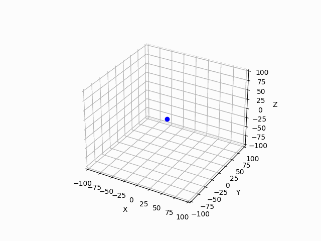
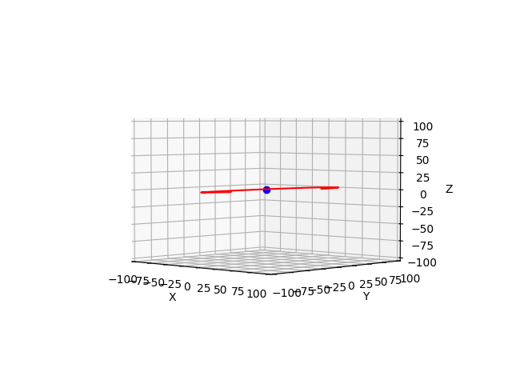
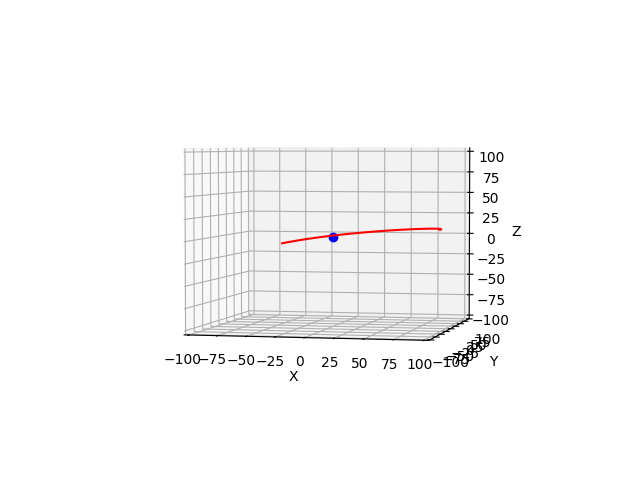
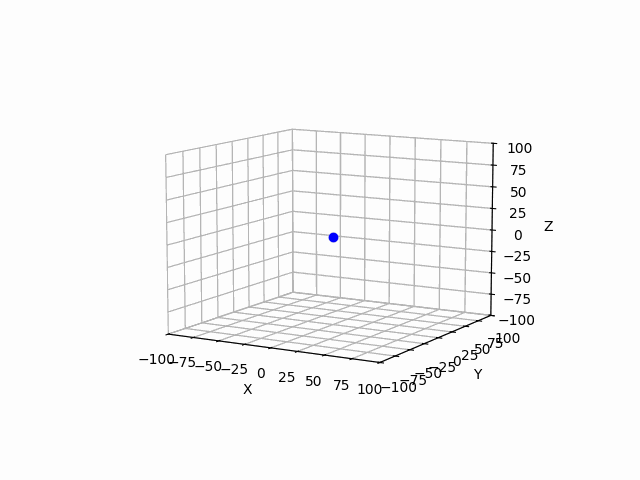
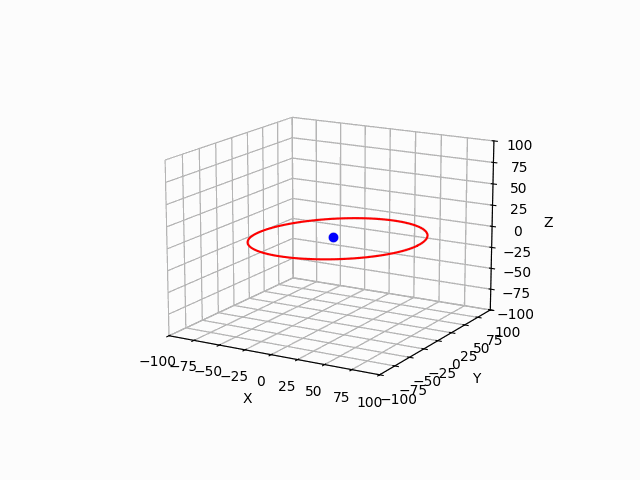
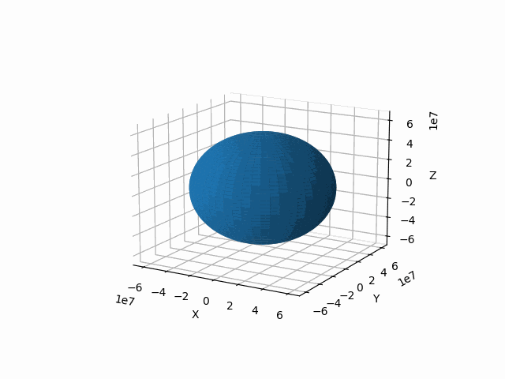

# Section 1.8 - Nearly Circular Orbits
This section of the book focuses on orbits that have an eccentricity that is just slightly larger than 0, or (as the title suggests) a nearly circular orbit. The first part of this section focuses on putting the various anomalies (true, eccentric, mean) and the radius in terms of each other by using a Taylor expansion around the eccentricity, as it is close to 0. From here, the d'Alembert property is found. The next part of this section focuses on finding how the different dimensions of the orbit oscillate by finding the epicycle approximations. Each of the variables in cylindrical coordinates are found to have different oscillations that depend on the given gravitational potential. Other oscillations are also found for the argument of periapsis and the ascending node, but the book mentions / shows that for a standard Kepler potential, these do not change. The last part of the book is considering the gravitational potential due to the Kepler potential and the multipoles as well. The book shows how each of the epicycles are approximated from the expanded gravitational potential and shows that the argument of periapsis and the ascending node each have a non-zero derivative with respect to time as well (both change over time). The book ends this section by briefly talking about how we can use this idea of wobbling orbits to define the osculating elements of a system, which are used to help characterize these orbits.

| Subsection of Document                            | Description of Subsection                                                                                                                                     |
| ------------------------------------------------- | ------------------------------------------------------------------------------------------------------------------------------------------------------------- |
| [Self Imposed Exercises](#self-imposed-exercises) | An outline of any exercises I thought would be beneficial or fun to work through that relate to the section of the book, usually exercises I make for myself. |
| [Project Description](#project-description)       | A description of the coding project I designed for this section of the book, as well as any relevant information I used.                                      |
| [Reflecting Thoughts](#reflecting-thoughts)       | Reflective thoughts about the chapter itself, the self imposed exercises I worked through, and the coding project I made for the section.                     |

## Self Imposed Exercises
text2

## Project Description
For this project, I thought it would be a fun idea to to and showcase what some of these nearly circular orbits looked like. The last two subsections surround this idea just in different ways, namely where the second subsection deals with the general epicycle approximation, and the last subsection deals with specifically the effect of multipole expansion on the potential. Since I wanted to showcase both of these, I figured I could split my own project into these two parts as well. As always, there is also a GUI that goes along with this project so that the program is more easily accessible.

### Epicycle Approximation
The book goes into great detail on how the approximations are found, but another method for modeling the two body system can be determined using a Taylor series approximation on the potential. Only looking at the first order equations for these provides us with the following approximations for the path of an orbiting body.

$$
z(t) = z_{0}\cos(\kappa_{z}t + \zeta), \quad \quad x(t) = x_{0}\cos(\kappa_{R}t + \eta), \quad \quad \phi(t) = \kappa_{\phi}t + \phi_{0} - \frac{2x_{0}\kappa_{\phi}}{R_{g}\kappa_{R}}\sin(\kappa_{R}t + \eta)
$$

Where $x$ is the deviation from the orbital radius $R_{g}$, $z$ is the altitude of the orbit, $\kappa$ is the frequency of the respective variable, and $\eta$ and $\zeta$ are integration constants. There is another form to write these in that the book outlines as well. Using just the linear part of the azimuth angle equation, we can re-write both $z$ and $x$ in terms of just $\phi$.

$$
x = x_{0} \cos \left[\frac{\kappa_{R}}{\kappa_{\phi}} (\phi - \phi_{R})\right], \quad \quad z = z_{0} \cos\left[\frac{\kappa_{z}}{\kappa_{\phi}}(\phi - \phi_{z})\right]
$$

This looks a bit nicer and is a tad easier to work with when actually making the code for the program itself. Doing it this way, means that I can use $\phi$ as an independent variable instead of relying on time (which can get a bit funky when coding).  

Before showing any orbits with wobble, I wanted to first get orbits that actually looked like normal orbits with some slight deviations in the $x$ and $z$ dimensions. Using code to implement this is pretty straightforward. I simply created an array between $[0, 2\pi]$ in order to get the full orbit as a period, then calculated the rest of the variables to get the full orbit. I stuck to a basic $r = 75$ with $x_{0} = 5$ and $z_{0} = 5$. Running the program gave me the following results. 

The left figure shows an animation of the orbit while the right figure shows a side profile of the orbit. As can be seen from the first figure, the difference in distance from the center body slightly changes as the orbit progresses. A similar situation can be seen with the altitude for the right figure. 

Something to keep in mind when working with these equations is that they are just Taylor Expansions. I ended up forgetting that while playing around with some values and ended up getting some wonky orbits. For fun I have shown them below, and you can see the curvy orbit that most definitely isn't a real orbit. Basically, when showing these orbits off (especially when we get to the main program part), it is important to not make out $x_{0}$ and $z_{0}$ too large.

### Methods of Representation
Now that I had a method for drawing an orbit, it was time to represent the wobble we see when working with nearly circular orbits. My first thought was to keep the same method of showing orbits that I have been doing (both in this project and many others). That method in particular is just showing an outline of the orbiting body. However, we have to make a small adjustment, as in order to see the wobble of an orbit, we need to see multiple orbits.

For clarity, I choose mostly random values for $\kappa_{R}, \kappa_{\phi}, \kappa_{z}$, while making sure we didn't get too far out of the approximation error (at least as far as the timescale on my orbit calculations, theoretically there shouldn't be any Taylor error). I extended the timescale to show about 2.5 orbits, and we get a nice wobble going.

While exaggerated, it's really cool to see the orbit change between after a cycle or two. However, this method of showing it is rather bad at showing long term orbits. Doing so makes everything very gross and messy looking. You end up getting a lot of red lines and it gets harder to see the differences between each orbit. For this reason, I decided to show the wobble through another representation. What I ended up going with is to show an entire orbit as a frame and then animate that. I think this shows the wobble very well, and this can be seen in the animation below.

When making the final project, I couldn't decided which method of representation I liked the most, so I asked some of my friends. Most of them ended up liking both, so for the final one, I decided to put both in, which an option to switch between the two.

###  Real Orbit Simulation
The last subsection of the book talks about how the epicycle approximation actually shows up in the real world, using the multipole expansion. The best part about this is that the book also provides us with the quadrupole of the Sun and the planets of the solar system. Because of this, I implemented both representations of the epicycle approximation for actual celestial bodies. For this section, I focused on Saturn (mostly because it has a high quadrupole moment), but the final project will have more.

For clarify sake, the equations for azimuthal ($\kappa_{\phi}$), radial ($\kappa_{R}$), and vertical ($\kappa_{z}$) frequency in terms of the multipole expansion are shown below. 

$$
\begin{aligned}
\kappa^{2}_{\phi} (R) =& \frac{GM}{R^{3}} \left[ 1 - \sum_{l=2}^{\infty} (l + 1)P_{l}(0)J_{l}\left( \frac{R_{p}}{R} \right)^{l} \right], \\
\kappa^{2}_{R} (R) =& \frac{GM}{R^{3}} \left[ 1 + \sum_{l=2}^{\infty} (l^{2} - 1)P_{l}(0)J_{l}\left( \frac{R_{p}}{R} \right)^{l} \right], \\
\kappa^{2}_{z} (R) =& \frac{GM}{R^{3}} \left[ 1 - \sum_{l=2}^{\infty} (l + 1)^{2}P_{l}(0)J_{l}\left( \frac{R_{p}}{R} \right)^{l} \right]
\end{aligned}
$$

Since the book only provides the quadrupole moment, that is all I used. The way this is implemented in the equations above is basically just using $l=2$. So, nothing crazy. From here, it is mostly just re-using the same method that I used for the previous orbit simulations. However, I decided to be cute and make the radius of the center body to be accurate towards the planet/star/moon that the orbiting body was orbiting around. Unfortunately, it leads to showing the following animation.

So, this looks bad, and I know what you might be thinking: "Why don't you fix it? You know what's wrong." And to that I counter, that is looks fine when you run it by yourself. I promise that in all of my tests, that the orbiting body does actually go in front of the big blue ball when it needs to. It is only when I saved the gif that it pushes the orbiting body behind it for some reason. I could not figure out the reason as to why *that* was happening, but if you want to see it how it is supposed to be, I encourage you to run the program yourself and see. 

## Reflecting Thoughts
### Section Thoughts
This section was alright. Like many of those in the past, I think it got more interesting the more I ended up reading, but compared to the previous two sections, I think I just enjoyed it enough. The most difficult part to wrap my head around in this section was probably the jump in the various equations that happened at the beginning. The text undersells just how much work is required to create those Taylor expansions. I did them to make sure I understood where they were coming from, but there was a ton of leg work. I ended up having to do two Taylor expansions, and both required using limits as the derivatives weren't defined at that point.

The most interesting, and rather straight forward part of the section was the middle and last. I am sure that those Taylor expansions are similarly hard, but they're easier to conceptualize. Plus, this part was a bit more interesting as we got to actually explore how the multipole moments affect orbits. I was curious how they would be used when they were introduced in the previous section, and I am glad I have a change to see them now.

### Self Imposed Exercise Thoughts
text5

### Project Thoughts
text6

### Concluding Thoughts
text7
